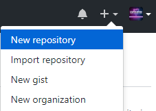
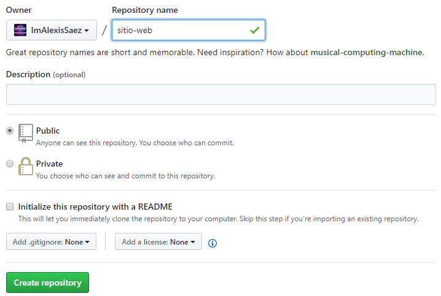

A estas alturas de la película, seguramente con algún que otro artículo
redactado y revisado localmente de manera concienzuda, no nos queda más remedio
que ocuparnos de un asunto un tanto tedioso: el alojamiento de nuestro sitio web
en _Internet_.

Para tal empresa he optado por _GitHub_, que nos permite alojar páginas web
estáticas de manera gratuita (¡y sin publicidad!). Desgraciadamente, el proceso
dista de ser intuitivo, por lo que examinaremos todos y cada uno de los pasos de
la [guía oficial](https://gohugo.io/hosting-and-deployment/hosting-on-github/)
con sumo detalle.

Para empezar, existe una serie de requisitos que hemos de cumplir para subir
nuestro sitio web a _GitHub_ y son:

- Tener instalado en nuestro equipo una versión de _Git_ superior a la `2.8`.
- Disponer de una cuenta de usuario en _GitHub_.
- Contar con una página web lista para ser publicada en _Internet_.

Por lo que respecta a los dos primeros puntos del listado anterior, si estamos
siguiendo el [Proyecto Metablog](/tags/metablog/) desde sus orígenes, no
supondrán problema alguno, pues fueron abordados en la
[primera entrada](/blog/preparando-el-equipo-para-hugo/) de la serie. En cuanto
al tercer punto, con todo el trabajo que llevamos acumulado hasta el momento, es
más que posible que entre nuestras manos tengamos ya un esbozo de sitio web que
merezca la pena mostrar al resto del mundo.

Una vez comprobado que satisfacemos los requisitos del procedimiento, el primer
paso a realizar consiste en crear dos nuevos repositorios en nuestra cuenta de
_GitHub_. Para ello, acudimos a la página de nuestro perfil en _GitHub_ y
hacemos clic en el símbolo `+` situado en la parte derecha del menú superior,
para, a continuación, seleccionar la opción `New repositoy`.



El primer repositorio que crearemos estará dedicado a almacenar el código fuente
de nuestro sitio web y, en un alarde de infinita originalidad, lo denominaremos
`sitio-web`, tal y como figura en la siguiente imagen. Cuando hayamos rellenado
el campo `Repository name` haremos clic en el botón `Create repository`.



A continuación, de las tres opciones que nos ofrece la página que aparece ante
nosotros, vamos a escoger la segunda, ya que cuando en
[esta entrada](/blog/creando-un-sitio-web-con-hugo/) generamos nuestro primer
sitio web, a la vez iniciamos un repositorio _Git_. Aquella acción, que en su
momento podía parecer un tanto extraña, queda ahora totalmente justificada.

Así pues, abrimos la terminal del sistema, nos desplazamos hasta el directorio
raíz donde hayamos decidido almacenar localmente nuestro sitio web y tecleamos:

```
git remote add origin https://github.com/<USERNAME>/sitio-web.git
```

En mi caso, en lugar de `<USERNAME>`, aparece directamente `ImAlexisSaez`. Cada
uno de nosotros tendrá definida esa parte del comando de manera diferente, por
lo que recomiendo encarecidamente copiar la instrucción de la página de _GitHub_
en lugar de la que aparece arriba.

Acto seguido, escribimos en la terminal:

```
git push -u origin master
```

De esta manera, transcurridos unos segundos, tendremos disponible en _GitHub_
una copia del código fuente que permite generar nuestra página web estática.

A continuación, volvemos a _GitHub_ y creamos un nuevo repositorio. Este último
tendrá un nombre especial que será, además, la dirección de acceso a nuestro
sitio web. Hemos de combinar nuestra cuenta de usuario en _GitHub_ con la
extensión `.github.io`. Por ejemplo, en mi caso queda `ImAlexisSaez.github.io` y
así es como rellené en su momento el campo `Repository name`. Una vez escrito,
simplemente tenemos que hacer clic en el botón `Create repository`.

Volvemos a la terminal del sistema y tecleamos `hugo server`, para poder dar así
una última revisión local a nuestro sitio web, utilizando la dirección
``http://localhost:1313`, y comprobar que todo está en perfecto estado. Cuando
estemos satisfechos, acudimos de nuevo a la terminal del sistema y cerramos el
servidor local, empleando para ello la combinación de teclas `Ctrl + c`.

Acto seguido, escribimos:

```
rm -rf public
```

Este comando borra por completo la carpeta `public`, que se encuentra en el
directorio donde tenemos almacenado localmente nuestro sitio web. Dicha carpeta
se genera automáticamente cada vez que tecleamos `hugo server` en la terminal
del sistema, y contiene la versión final de nuestra página web.

El siguiente paso, precisamente, es crear un submódulo de manera que la carpeta
`public` apunte a otra dirección de _GitHub_. Para ello, desde la terminal del
sistema, tecleamos

```
git submodule add -b master git@github.com:<USERNAME>/<USERNAME>.github.io.git public
```

donde sustituiremos `<USERNAME>` por el nombre de nuestra cuenta de usuario en
_GitHub_ (por ejemplo, `ImAlexisSaez` en mi caso).

¡Ya casi tenemos todo a punto! Únicamente hemos de abrir _Sublime Text 3_ y en
un archivo, que guardaremos como `deploy.sh` en el directorio raíz donde hayamos
almacenado localmente nuestro sitio web, copiamos el siguiente bloque de código:

```
#!/bin/bash

echo -e "\033[0;32mDeploying updates to GitHub...\033[0m"

# Build the project.
hugo # if using a theme, replace with `hugo -t <YOURTHEME>`

# Go To Public folder
cd public
# Add changes to git.
git add .

# Commit changes.
msg="rebuilding site `date`"
if [ $# -eq 1 ]
  then msg="$1"
fi
git commit -m "$msg"

# Push source and build repos.
git push origin master

# Come Back up to the Project Root
cd ..
```

El anterior bloque de código se encarga, de manera automática, del proceso de
subida de nuestro sitio web a _GitHub_. Para utilizarlo, desde la terminal del
sistema, nos situaremos en el directorio raíz donde hayamos decidido almacenar
nuestro sitio web y teclearemos

```
./deploy.sh "Mensaje que resuma los cambios"
```

En mi caso, no me suelo esforzar mucho en declarar mensajes óptimamente
descriptivos y, por ejemplo, cuando suba esta entrada el comando será del estilo
`./deploy.sh "Añade entrada 20180901"`. Los mensajes asociados al repositorio
donde guardo el código fuente sí que intento que sean más expresivos y reflejen
adecuadamente los cambios de las diferentes versiones.

Con esto, damos por finalizado el proceso y nuestro sitio web será ahora
accesible para todo el mundo a través de la dirección web que proporciona el
segundo repositorio que hemos creado (en mi caso
`https://imalexissaez.github.io/`).

En la siguiente entrada catalogada bajo la etiqueta [Metablog](/tags/metablog/)
posiblemente empecemos a realizar cambios en la hoja de estilos _CSS_ y
personalizar todavía más el tema _Beautiful Hugo_.
