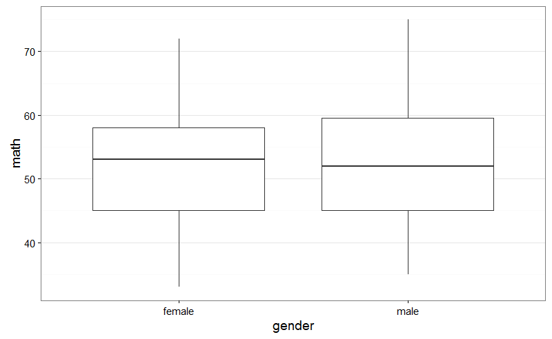
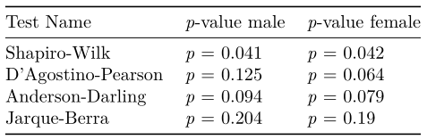
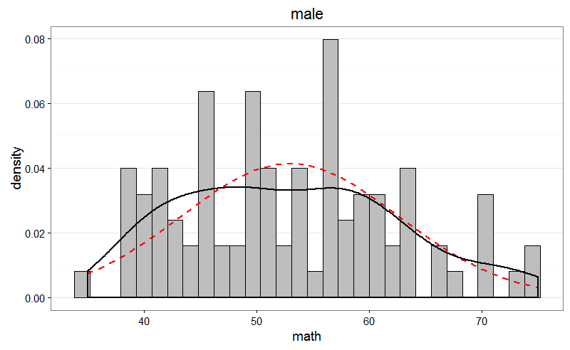
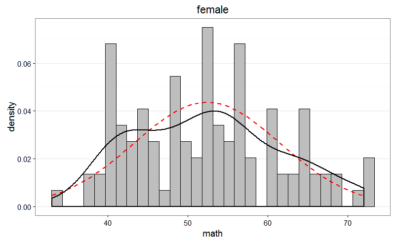
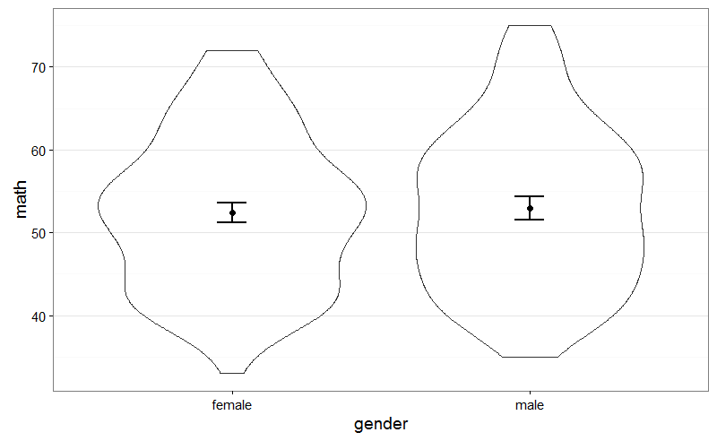
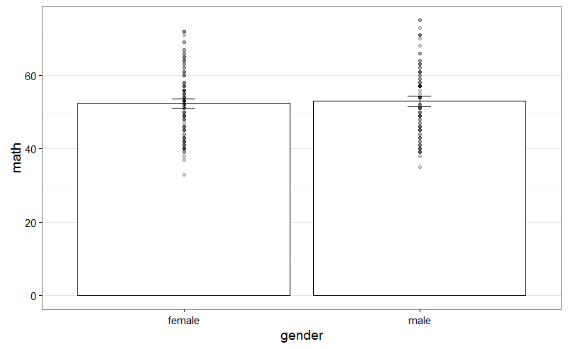
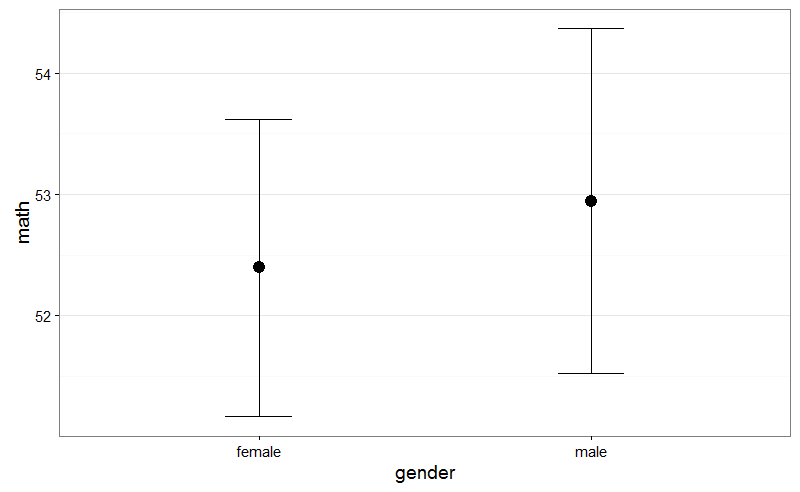

En mi reciente vuelta a _Twitter_, he empezado a seguir al profesor responsable
del excelente _MOOC_ "_Improving your statistical inferences_"
([enlace](https://www.coursera.org/learn/statistical-inferences)), _Daniël
Lakens_ ([@lakens](https://twitter.com/lakens)), que comparte más que
interesantes perlas relacionadas con el campo de la estadística.

Hace unos días anunciaba que había actualizado un _script_ para _R_ cuyo nombre
no tiene desperdicio: "_Perfect t-test_". Las principales referencias que
tenemos que consultar son:

- [The perfect t-test](http://daniellakens.blogspot.com.es/2015/05/the-perfect-t-test.html).
- [Repositorio](https://github.com/Lakens/Perfect-t-test) en _GitHub_ con el
  código asociado al anterior artículo.

Como no podía ser de otra manera, un recurso así despierta enormemente tanto mi
curiosidad, como las ganas de echar un rato explorando las posibilidades que
ofrece.

Ahora bien, ¿de qué trata todo el asunto? Estamos ante un documento escrito con
_R Markdown_ cuyo objetivo es automatizar el proceso de comparación de medias
para dos muestras, tanto independientes como dependientes (cada caso tiene su
archivo asociado). No obstante, cuando la mayoría de programas informáticos
orientados al análisis de datos ya incorporan este tipo de herramienta, ¿qué
justifica la existencia de este recurso?

Según el autor, no todos los investigadores siguen las recomendaciones que los
estadísticos indican (o bien no están al día de las mismas), e incluso, hecho
que personalmente considero más grave, los propios programas informáticos
ignoran dichas recomendaciones en ocasiones.

Dentro del "peligro" que supone emplear algoritmos que automatizan análisis de
datos, que pueden provocar que llevemos a cabo todo tipo de acciones sin saber
muy bien las razones para ello, dado que los vamos a utilizar igualmente,
siempre será más recomendable que escojamos aquellos que mejor diseñados estén,
¿verdad?

Veamos qué nos ofrece el código de _Daniël Lakens_. Una vez digerido el _README_
del repositorio, e instalado los paquetes necesarios (así como actualizado
_JAGS_, que aún estaba utilizando la versión 3), sólo tengo que encontrar algún
conjunto de datos que me permita llevar a cabo una prueba _t_.

He escogido el conjunto de datos `hsb2` (incluido en el paquete `openintro`),
que está formado por los registros de una encuesta realizada a 200 estudiantes
de secundaria. Vamos a investigar una simple cuestión, ¿existen diferencias en
las puntuaciones, asociadas a matemáticas, entre chicos y chicas? Para resolver
el interrogante, lo primero que debemos hacer es generar un archivo de texto que
contenga los datos de interés, siguiendo el formato que se nos especifica en el
archivo `perfect_independent_t-test.Rmd`.

```r
# Carga la librería que contiene el conjunto de datos hsb2
library(openintro)

# Carga el conjunto de datos hsb2
data(hsb2)

# Documentación del conjunto de datos
?hsb2

# Exploración básica del conjunto de datos
str(hsb2)

# Crea el archivo que se usará con "perfect_independent_t-test.Rmd"
write.table(hsb2[c("id", "gender", "math")],
            file = "datos_hsb2_math.txt",
            row.names = FALSE,
            sep = ",")
```

_Nota_: en lugar de crear un archivo de texto cuyas columnas estuvieran
delimitadas por tabuladores, escogí utilizar comas. Eso luego implica realizar
modificaciones menores en el fichero de la prueba _t_.

Ahora, con `datos_hsb2_math.txt` ubicado en el mismo directorio que
`perfect_independent_t-test.Rmd`, únicamente tenemos que actualizar la ruta que
aparece en la línea 62 para la variable `alldata` (y, en mi caso, añadir
`sep = ","`), así como correctamente asignar las variables `xlabel`, `ylabel`,
`factorlabel`, `measurelabel`, `xlabelstring` e `ylabelstring` siguiendo las
instrucciones. El resto de variables, para una primera aproximación a esta
herramienta, podemos dejarlas con los valores que han recibido por defecto.

En mi caso, he cambiado el formato del documento de salida de _Word_ a _PDF_, y,
tras pulsar el botón correspondiente, he acabado con un documento ¡de 15 páginas
para una simple prueba _t_! A la próxima persona que escuche quejarse de que
_SPSS_ devuelve una miríada de resultados voy a invitarle amablemente a que
utilice este _script_.

Sin embargo, una vez superado el susto inicial, gran parte del documento son
explicaciones generales que justifican el modo de proceder seguido. La primera
figura que encontramos es el siguiente _boxplot_ (creo que en español se llama
_diagrama de caja y bigotes_, pero no estoy completamente seguro), con el objeto
de identificar la existencia de posibles valores atípicos:



A continuación, se realizan cuatro contrastes de hipótesis para comprobar si se
verifica el supuesto de normalidad para las puntuaciones de ambos grupos (su
violación tiene efectos, por ejemplo, sobre el _error de tipo I_):



En uno de los cuatros contrastes, los datos con los que estamos trabajando
aportan evidencia suficiente para sospechar de la veracidad de la hipótesis nula
("las puntuaciones siguen una distribución normal"), por lo que tendríamos que
preferiblemente recurrir a métodos no paramétricos o estadísticos robustos. No
obstante, en el propio documento nos avisan de que con muestras grandes (y
podemos considerar que la dada lo es) este tipo de situaciones pueden
presentarse.

Podemos examinar la distribución de puntuaciones, para cada uno de los grupos,
de manera gráfica, a partir de las siguientes figuras, y juzgar así cómo se
desvían nuestros datos (línea negra) de la distribución normal asociada (línea
discontinua roja):





Por si las anteriores figuras todavía no resolvieran el interrogante, tenemos a
nuestra disposición los siguientes _gráficos Q-Q_:


No resulta por tanto descabellado aceptar que se verifica el supuesto de
normalidad para los datos dados. Pasemos ahora a estudiar la hipótesis de
igualdad de varianzas entre los grupos considerados. Para ello, utilizaremos la
_prueba de Levene_, que en nuestro caso particular concluye:

> Levene’s test for equality of variances (p = 0.46) indicates that the
> assumption that variances are equal is not rejected.

A continuación encontramos la sección de resultados donde, siguiendo el estilo
de publicación de las revistas científicas, se recogen las conclusiones para la
prueba _t_ que hemos llevado a cabo. Aquí, en función de la filosofía con la que
solamos trabajar y de si se verifican las condiciones asociadas a esta prueba,
tendremos que escoger entre la sección dedicada a estadísticos frecuentistas,
bayesianos o robustos. Por ejemplo, para la primera opción encontraríamos:

> The mean math of participants in the male condition (M = 52.95, SD = 9.66, n
> = 91) was greater than the mean of participants in the female condition (M =
> 52.39, SD = 9.15, n = 109). The difference between the two measurements (M =
> 0.55, 95% CI = [-2.09;3.19]) was analyzed with Welch’s t-test, t(187.58) =
> 0.41, p = 0.682, Hedges’ g = 0.06, 95% CI [-0.22;0.34]. This can be considered
> a tiny effect. The observed data is not surprising under the assumption that
> the null-hypothesis is true. The Common Language effect size (McGraw &
> Wong, 1992) indicates that the likelihood that the math of a random person in
> the male condition is greater than the math of a random person in the female
> condition is 52%.

Tenemos a nuestra disposición la media, la desviación estándar y el tamaño
muestral para cada uno de los grupos considerados. A continuación encontramos el
valor del estadístico asociado a la prueba _t_ de _Welch_, así como su
correspondiente _p_-valor. Como indicador del tamaño del efecto encontramos la
_g_ de _Hedges_. Sin embargo, al margen del aluvión de valores con el que ya
seríamos capaces de dar respuesta al interrogante que ha motivado este artículo
(¿seríamos de verdad capaces?), me ha encantado la parte final de este párrafo,
donde nos transmiten con palabras llanas qué conclusiones deberíamos extraer.

El documento añade los gráficos que mostraré a continuación, así como las
referencias para las justificaciones vertidas a lo largo de él, el propio
conjunto de datos y cierta información técnica de la sesión de trabajo en _R_.
Es un estupendo recurso para tener siempre disponible a mano, ¿verdad?






