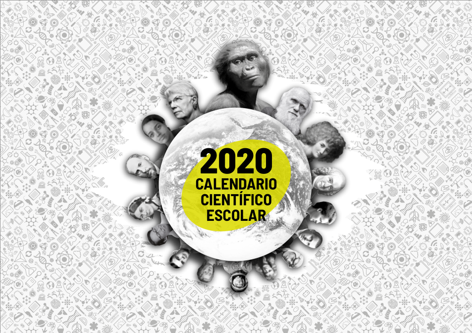

La _Fundación Española para la Ciencia y la Tecnología_ publicó hace unos días
un interesante calendario con el propósito de divulgar la cultura científica en
las aulas y, además, visibilizar a las mujeres científicas y tecnólogas.

Podemos acceder a él a través de
[este enlace](http://www.igm.ule-csic.es/calendario-cientifico) y entre sus
puntos fuertes destacaría:

- Su disponibilidad en cinco lenguas: castellano, gallego, euskera, catalán y
  asturiano.
- La guía didáctica que lo acompaña, que cuenta con diferentes actividades
  sugeridas. Están organizadas en función de la etapa educativa en la que se
  encuentre el alumnado con el que deseemos trabajar este recurso.

No obstante, en mi opinión, tras una rápida primera visualización, encuentro que
la organización del calendario presenta una considerable cantidad de espacio
desaprovechado (sobre todo en la parte asociada al final de cada mes). De cara a
su posible impresión, me habría gustado un enfoque más clásico, que utilizara
únicamente una página por mes.
