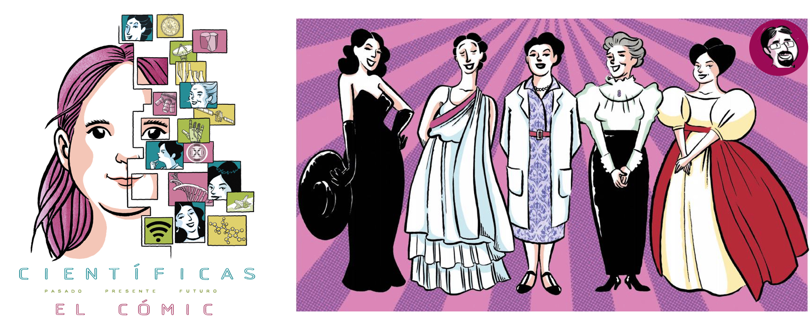

La _Universidad de Sevilla_ pone a nuestra disposición un interesante recurso
ahora que se aproxima el _Día Internacional de la Mujer_: "Científicas, el
cómic".

Se puede acceder a él a través de
[este enlace](http://institucional.us.es/cientificas/comic/) e incluso
disponemos de una _guía didáctica_ con actividades sugeridas relacionadas con el
tema. La calidad de las ilustraciones es excelente y el contenido está
seleccionado y diseñado de una forma que hace que resulte una lectura muy amena.

No obstante, me gustaría destacar que el cómic no es más que uno de los
apartados de la propia [web](http://institucional.us.es/cientificas/), que
"esconde" otro recurso maravilloso: un corto que resume la obra de teatro. Su
duración es de apenas 20 minutos, de manera que es factible que el alumnado lo
visualice en una sesión y después la complementemos, por ejemplo, con algunas de
las actividades disponibles en la propia web.


