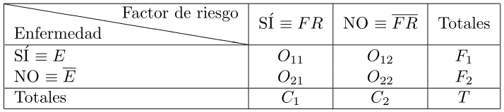

Reconozco que la edición de tablas, junto con la gestión de figuras, a veces se
convierte en una pequeña pesadilla para mí cuando estoy generando documentos con
_LaTeX_. Veamos cómo he dado respuesta a la cuestión que aparece en el título de
esta entrada.

Es habitual en estadística que trabajemos con tablas de contingencia, sobre todo
en su versión $2\times 2$. Estas se suelen caracterizar por tener la celda que
ocupa la esquina superior izquierda dividida diagonalmente, de manera que el
texto inferior de dicha celda hace referencia al contenido de las filas (por
ejemplo, si se posee o no cierta enfermedad), mientras que el texto superior
hace lo propio para las columnas (por ejemplo, si se está expuesto a un factor
de riesgo o no).

Ahora bien, enseguida aparece la pregunta del millón: ¿cómo conseguimos ese
efecto con _LaTeX_? La respuesta viene de la mano del paquete `slashbox`, cuyo
uso es realmente sencillo. Veamos un ejemplo de aplicación:

```tex
\documentclass{article}

\usepackage[utf8]{inputenc}
\usepackage[english, spanish]{babel}

\usepackage{slashbox}

\begin{document}

\begin{tabular}{|l|c|c|c|}
\hline
\backslashbox{Enfermedad}{Factor de riesgo} & SÍ $\equiv FR$ & NO $\equiv \overline{FR}$ & Totales\\
\hline
SÍ $\equiv E$ & $O_{11}$ & $O_{12}$ & $F_1$ \\
NO $\equiv \overline{E}$ & $O_{21}$ & $O_{22}$ & $F_2$ \\
\hline
Totales & $C_1$ & $C_2$ & $T$ \\
\hline
\end{tabular}

\end{document}
```

Podemos apreciar el resultado en la siguiente imagen:



_Referencias_:

- [LaTeX table cell with a diagonal line and 2 sub cells [duplicate]](http://tex.stackexchange.com/questions/27193/latex-table-cell-with-a-diagonal-line-and-2-sub-cells).
- [Diagonally divided table cell [duplicate]](http://tex.stackexchange.com/questions/7262/diagonally-divided-table-cell).
