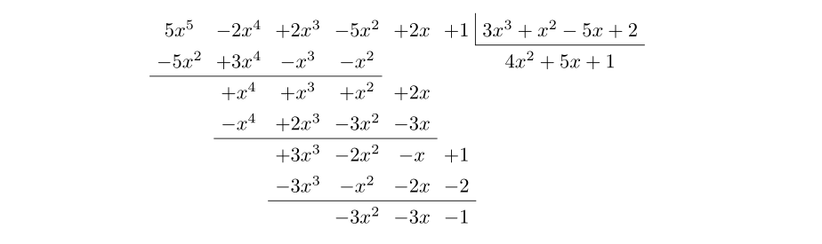

La [semana anterior](/blog/cmo-dividir-polinomios-con-latex/) analizamos el
paquete `polynom`, que nos permite fácilmente llevar a cabo la transcripción de
divisiones de polinomios con _LaTeX_. A continuación, estudiaremos una manera
alternativa para lidiar con este asunto que, además, nos permitirá operar en
conjuntos finitos.

Supongamos, sin pérdida de generalidad, que nuestro objetivo es dividir los
polinomios

$$
5x^5 - 2x^4 + 2x^3 - 5x^2 + 2x + 1
$$

y

$$
3x^3 + x^2 - 5x + 2
$$

en $\mathbb{Z}_7$. Para ello, ''dibujaremos'' la operación matemática en una
matriz, método que nos permitirá organizar fácilmente los pasos y, de paso,
imprimir algunas rayas horizontales cuando proceda.

Para empezar, en el preámbulo del documento, insertamos las dos siguientes
líneas:

```tex
\usepackage{tikz}
\usetikzlibrary{matrix}
```

Ahora, donde deseemos ubicar la división de los anteriores polinomios,
tecleamos:

```tex
\begin{center}
\begin{tikzpicture}
\matrix (a) [matrix of math nodes, column sep=0pt]
{
5x^5 & -2x^4 & +2x^3 & -5x^2 & +2x & +1 &  & 3x^3+x^2-5x+2 \\
};
\draw (a-1-8.north west) |- (a-1-8.south east);
\end{tikzpicture}
\end{center}
```

dando el resultado que figura en la siguiente imagen:


Organizar los monomios del dividendo como elementos individuales de una matriz
nos facilitará la empresa de ''alinear'' las posteriores operaciones de la
división. Por otro lado, el comando `draw` es el que dibuja la ''caja'' de esta
operación matemática, tomando como referencia las posiciones de los elementos de
la matriz.

Continuemos la división, siempre teniendo en cuenta que trabajamos en
$\mathbb{Z}_7$. Así, para la primera etapa, teclearíamos acto seguido:

```tex
\begin{center}
\begin{tikzpicture}
\matrix (a) [matrix of math nodes, column sep=0pt]
{
 5x^5 & -2x^4 & +2x^3 & -5x^2 & +2x & +1 &  & 3x^3+x^2-5x+2 \\
-5x^2 & +3x^4 &  -x^3 &  -x^2 &     &    &  & 4x^2\\
      &  +x^4 &  +x^3 &  +x^2 & +2x &    &  & \\
};
\draw (a-1-8.north west) |- (a-1-8.south east);
\draw (a-2-1.south west) -- (a-2-4.south east);
\end{tikzpicture}
\end{center}
```

cuyo resultado se recoge en la siguiente figura:


Efectivamente, no queda tan estético como el que conseguíamos la semana pasada
con el paquete `polynom`. No obstante, funcionalmente hablando, los pequeños
desajustes horizontales de signos no molestan en exceso.

Una vez asimilada la idea del procedimiento a seguir, únicamente nos resta
continuar con la división, escribiendo ahora:

```tex
\begin{center}
\begin{tikzpicture}
\matrix (a) [matrix of math nodes, column sep=0pt]
{
 5x^5 & -2x^4 & +2x^3 & -5x^2 & +2x & +1 &  & 3x^3+x^2-5x+2 \\
-5x^2 & +3x^4 &  -x^3 &  -x^2 &     &    &  & 4x^2 + 5x + 1\\
      &  +x^4 &  +x^3 &  +x^2 & +2x &    &  & \\
      &  -x^4 & +2x^3 & -3x^2 & -3x &    &  & \\
      &       & +3x^3 & -2x^2 &  -x & +1 &  & \\
      &       & -3x^3 &  -x^2 & -2x & -2 &  & \\
      &       &       & -3x^2 & -3x & -1 &  & \\
};
\draw (a-1-8.north west) |- (a-1-8.south east);
\draw (a-2-1.south west) -- (a-2-4.south east);
\draw (a-4-2.south west) -- (a-4-5.south east);
\draw (a-6-3.south west) -- (a-6-6.south east);
\end{tikzpicture}
\end{center}
```

Obteniendo como resultado el que aparece en la siguiente imagen:


