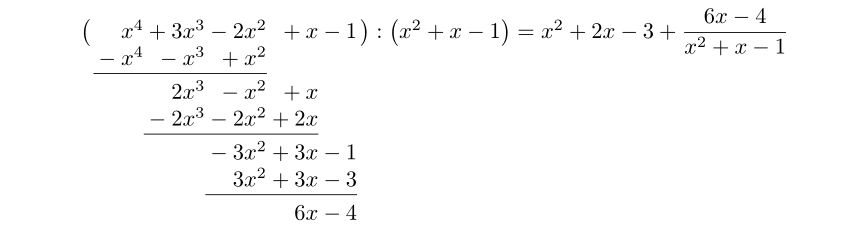
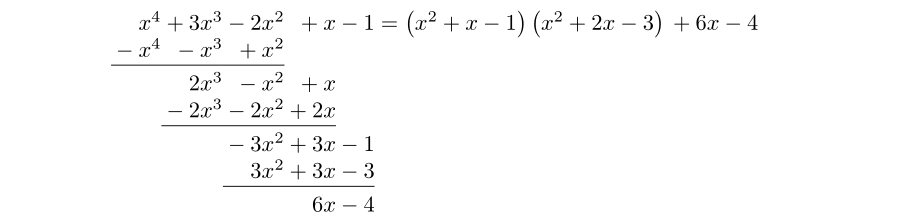

Escribiendo unos apuntes sobre polinomios, llegó el momento de mostrar un
ejemplo de la división de un par de ellos. La clásica pregunta no se hizo
esperar, ¿cómo transcribo en _LaTeX_ esa operación matemática?

Acompañemos este artículo con un ejemplo concreto. Sean

$$
P = x^4 + 3x^3 - 2x^2 + x - 1
$$

y

$$
Q = x^2 + x - 1
$$

los polinomios implicados en la división, siendo nuestro objetivo mostrar la
mencionada operación paso por paso (y no simplemente ofrecer el resultado final,
acción que no entraña misterio a la hora de llevarla a cabo con _LaTeX_).

Como suele ser habitual, tras una rápida búsqueda con _Google_, no soy la
primera persona que se ha encontrado en esta encrucijada. En los foros que
consulté, la recomendación estándar era emplear el paquete
[polynom](https://ctan.org/pkg/polynom), que a través del comando `\polylongdiv`
nos facilita enormemente la tarea. De forma automática, se ocupa de realizar y
organizar (con _LaTeX_) todos los pasos involucrados en una división de
polinomios.

Así pues, empecemos ubicando en el preámbulo de nuestro documento la siguiente
instrucción:

```tex
\usepackage{polynom}
```

Antes de proceder a realizar división alguna, conviene que declaremos
personalmente el valor de ciertos argumentos opcionales:

```tex
\polyset{style=C, div=:, vars=x}
```

donde:

- `style`: declara el estilo con el que efectuará la división de polinomios,
  pudiendo escoger entre los valores `A`, `B` y `C`.
- `div`: señala el símbolo con el que se expresará la división (dependiendo del
  estilo escogido, la asignación de este parámetro es importante).
- `vars`: indica el valor de la variable del polinomio. Generalmente utilizamos
  `x`, pero no es descabellado emplear `n` cuando estamos lidiando con temas
  asociados a números enteros.

Ahora, allí donde deseemos ubicar la división de los polinomios $P$ y $Q$
definidos arriba, tecleamos:

```tex
$$\polylongdiv{x^4+3x^3-2x^2+x-1}{x^2+x-1}$$
```

Obteniendo como resultado:



Estudiemos el resultado visual de la operación bajo los distintos estilos que
nos ofrece el paquete `polynom`.

**Estilo A**:


**Estilo B**:



**Estilo C**:


Personalmente, el último de los mostrados es el estilo que me resulta más
atractivo para mostrar cómo realizar paso a paso una división de polinomios con
_LaTeX_. No obstante, como siempre, ''para gustos, los colores''.

Para finalizar, me gustaría comentar que:

- Aun siendo bastante satisfactoria esta solución, ninguno de los estilos que
  ofrece el paquete `polynom` se ajusta exactamente a como habitualmente
  organizamos la división por estos lares.
- Por limitaciones de _TeX_, no podemos llevar a cabo la división de polinomios
  en conjuntos finitos como, por ejemplo, $\mathbb{Z}_4$ o en el cuerpo
  $\mathbb{Z}_7$.

En ambos casos, una posible vía de escape que he encontrado es recurrir al
paquete `tikz` y, manualmente, ''dibujar'' la propia división de polinomios. No
es un proceso demasiado complejo y quizá lo ilustre en una futura entrada.
