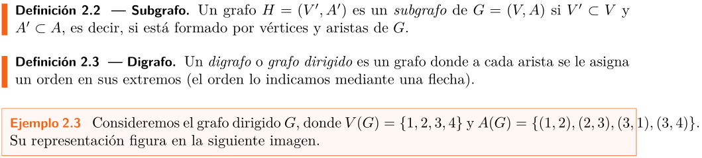
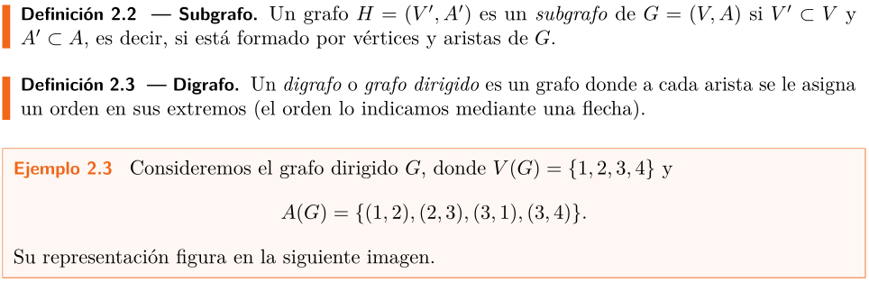
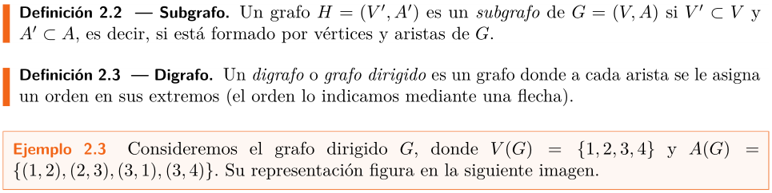
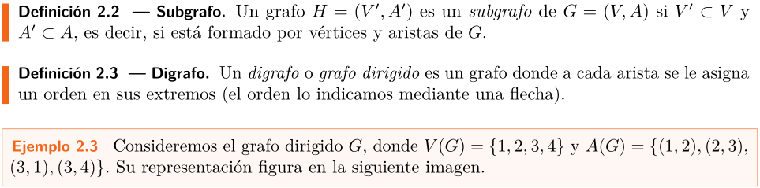

Cierto es que _LaTeX_ genera unos documentos matemáticos realmente vistosos. No
menos cierto es que el comportamiento de _LaTeX_, en ocasiones, es un tanto
peculiar, ofreciendo duras batallas para solventar ciertos problemas.

En esta ocasión, me encontraba esta misma mañana redactando unos apuntes de
teoría de grafos cuando, en un ejemplo trivial donde los haya, he hallado este
desbarajuste:

He definido el conjunto de aristas del grafo casi en el borde del margen y
_LaTeX_, en lugar de romper la expresión matemática como en otras ocasiones hace
de manera automática, ha decidido rebasar el margen derecho. El resultado,
estéticamente, es horroroso, por mucho que el mencionado conjunto este bien
agrupado y su lectura resulte cómoda.

Generalmente, cuando me encuentro en este tipo de situaciones, opto por
reescribir la oración, de manera que añado o suprimo texto y, al final, se
produce un buen encaje del contenido matemático en los márgenes.

No obstante, quizá buscando pretextos absurdos para descansar un rato de la
transcripción de apuntes, me he decantado esta mañana por investigar las
posibilidades que ofrece _LaTeX_ para evitar que este comportamiento tenga
lugar. Tras una rápida búsqueda en _Google_, he dado con
[esta entrada](https://tex.stackexchange.com/questions/28818/how-can-i-prevent-inline-math-formulas-from-overflowing-into-the-margin),
cuya lectura es más que recomendable.

Una de las primeras opciones que tenemos a nuestra disposición, lógicamente, es
escribir la problemática expresión matemática en una línea independiente. En mi
caso, el resultado sería el siguiente:

Sin embargo, ¿no adquiere así un protagonismo inmerecido el conjunto de aristas
del grafo? No termina de convencerme, para esta situación particular, la
solución propuesta.

Una alternativa es emplear el comando `\sloppy` antecediendo el párrafo donde
reside la expresión matemática que ha decidido realizar una excursión por los
márgenes del documento. Esta instrucción juega con el espaciado entre las
palabras, siendo su resultado el que muestro a continuación:

Sinceramente, tampoco resulta de mi agrado. ¿Qué más opciones tenemos? Utilizar
el comando `\allowbreak` allá donde queramos se produzca la separación en
nuestra expresión matemática. Volviendo a la situación original, parece que
sería adecuado cortar la declaración del conjunto de aristas del grafo tras el
elemento $(2, 3)$ y el resultado ahora es

Esta solución, en mi opinión, es la más agradable visualmente hablando. No
obstante:

- Insertar el comando `\allowbreak` resta bastante legibilidad al código fuente
  del documento.
- Si _LaTeX_ no ha decido "romper" automáticamente la declaración de un
  conjunto, debemos sospechar que algún buen motivo tendrá. Efectivamente, con
  este enfoque, resulta un tanto más complicado seguir la definición del
  conjunto de aristas del grafo.

En conclusión, arriba tenemos tres estrategias que resuelven el problema
planteado de mejor o peor manera. No obstante, es posible que al final me
decante por la reescritura de la línea y evite recurrir a alguna de ellas.
