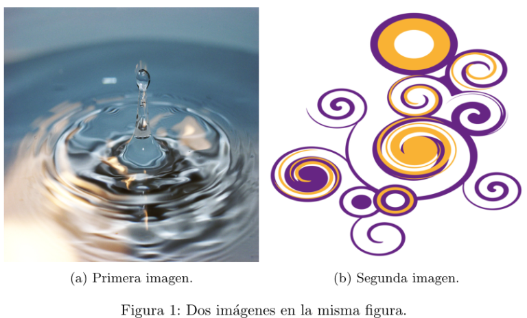

Es muy útil poder incluir varias imágenes en la misma figura, bien sea porque
están relacionadas de alguna manera, bien debido a que resulta mucho más
sencillo hacer una comparación si se colocan juntas.

Lidiar con elementos flotantes en _LaTeX_ no siempre es una tarea agradecida,
pero, en esta ocasión, y sin que sirva de precedente, crear composiciones de
múltiples imágenes dentro de una figura es bastante sencillo.

A continuación, muestro los pasos que podemos seguir para ello:

1. Dentro del entorno `figure`, crearemos tantos entornos `subfigure` como
   imágenes queramos incluir en la composición.
2. El parámetro opcional del entorno `subfigure`, `[b]` en el ejemplo que
   aparece abajo, sigue las clásicas pautas de los elementos flotantes en
   _LaTeX_, y será de suma utilidad que lo definamos con precisión si las
   imágenes poseen diferentes alturas.
3. Con `textwidth` controlaremos la anchura de las imágenes. Por ejemplo, para
   que aparezcan dos imágenes, una al lado de otra, y que ocupen la mayor parte
   del espacio horizontal del documento con el que estemos trabajando, `0.49`
   será un valor adecuado, pues deja un leve espacio blanco entre ellas. Si no
   queremos que aparezcan tan juntas, simplemente tendremos que reducir la
   anterior cantidad. Para tres imágenes, `0.33` es el valor que consigue que
   éstas aparezcan una a continuación de la otra, dejando leves espacios blancos
   entre ellas.
4. Una vez declarados tanto el parámetro opcional como el obligatorio,
   incluiremos la imagen dentro del entorno `subfigure` utilizando las
   instrucciones habituales. Como hemos cargado en el preámbulo los paquetes
   _caption_ y _subcaption_, podremos incluir los comandos `caption` y `label`
   en cada una de las imágenes, por si luego queremos hacer referencia a alguna
   de ellas.
5. Utilizar `hfill` entre los distintos entornos `subfigure` provoca que las
   imágenes queden empujadas hacia los márgenes del documento. Este efecto nos
   puede resultar de interés si no estamos trabajando con esos valores límites
   (como `0.49`) para la anchura de las imágenes.

Con un ejemplo quedará más claro el procedimiento que hemos de seguir:

```tex
\documentclass{article}

\usepackage[utf8]{inputenc}
\usepackage[english, spanish]{babel}

\usepackage{graphicx}
\usepackage{caption}
\usepackage{subcaption}

\begin{document}

\begin{figure}[!tbp]
  \begin{subfigure}[b]{0.49\textwidth}
    \includegraphics[width=\textwidth, height=\textwidth]{img1.jpg}
    \caption{Primera imagen.}
    \label{fig:f1}
  \end{subfigure}
  \hfill
  \begin{subfigure}[b]{0.49\textwidth}
    \includegraphics[width=\textwidth, height=\textwidth]{img2.jpg}
    \caption{Segunda imagen.}
    \label{fig:f2}
  \end{subfigure}
  \caption{Dos imágenes en la misma figura.}
\end{figure}

\end{document}
```

Podemos apreciar el resultado en la siguiente imagen:



_Nota_: no es recomendable que forcemos el parámetro `height` para que se ajuste
al `textwidth` definido, pues generalmente provocará distorsiones no deseadas en
nuestras imágenes. Si aparece en el ejemplo anterior no es más que por descuido,
ya que de las distintas configuraciones con las que he estado experimentando,
esa ha sido precisamente la última y no he caído en cambiar ese detalle antes de
publicar el código.

_Referencia_:

- [Putting two images beside each other](http://tex.stackexchange.com/questions/148438/putting-two-images-beside-each-other).
