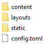

Continuemos esta serie de artículos, catalogados bajo la etiqueta
[Metablog](/tags/metablog/), donde examinamos con detalle la creación de sitios
web utilizando _Hugo_. Hoy veremos cómo instalar y configurar el tema
[Beautiful Hugo](https://themes.gohugo.io/beautifulhugo/).

En la [anterior entrada](/blog/configurando-el-tema-ananke/) vimos el proceso a
seguir para el tema _Anake_. No obstante, como ya comenté entonces, algunos
detalles de dicha plantilla no terminaban de convencerme para la idea que tenía
en mente para _Infinitos Contrastes_. Así pues, tras invertir una considerable
cantidad de tiempo en navegar por la
[sección de temas](https://themes.gohugo.io/) de la web oficial de _Hugo_,
encontré, para mi fortuna, el tema _Beautiful Hugo_, una adaptación del tema
_Beautiful Jekyll_ que ya utilicé en su momento como plantilla para mi sitio
web.

Me encanta este tema por el protagonismo que ofrece al contenido, evitando toda
esa miríada de elementos que algunas plantillas incorporan y que distraen
enormemente la atención a la hora de consultar la información contenida en los
artículos. Además, viene con el interesante añadido para un matemático de
incorporar, de serie, la configuración adecuada para escribir fórmulas vía
_KaTeX_ (es un detalle con cierta trampa, ya que buenas batallas estoy lidiando,
en ocasiones, para que las expresiones matemáticas se visualicen como deberían).

Así pues, procedamos a su instalación. Para ello, en la terminal, desde el
directorio raíz donde hayamos escogido alojar localmente nuestro sitio web,
tecleamos:

```
cd themes
```

y clonamos, en esta carpeta, el tema _Beautiful Hugo_ escribiendo:

```
git clone https://github.com/halogenica/beautifulhugo.git beautifulhugo
```

Al igual que el tema _Anake_, _Beautiful Hugo_ viene acompañado, para nuestro
gozo y disfrute, con un pequeño sitio web de muestra, ubicado en la carpeta
`exampleSite` (siendo la ruta completa `\themes\beautifulhugo\exampleSite`). A
través del _Explorador de archivos_ de _Windows_ podemos comprobar que su
contenido es el que se muestra en la siguiente imagen:



Procedemos entonces a copiar las carpetas `contents`, `layouts` y `static`, así
como el archivo `config.toml` y las pegamos en el directorio raíz de nuestro
sitio web. A estas alturas de la película, dependiendo de la intensidad con la
que hayamos estado experimentando con diversas plantillas, recomendaría incluso
eliminar previamente las mencionadas carpetas y el citado fichero antes de
proceder a la acción de pegar, para así evitar la aparición de extraños
conflictos en un futuro próximo.

Ahora, editamos el archivo `config.toml`, utilizando _Sublime Text 3_ para ello,
con el objetivo de empezar a personalizar la configuración de esta plantilla.
Algunos de los detalles que a continuación veremos son muy similares a los que
discutimos durante el artículo dedicado al tema _Anake_, por lo que en esta
ocasión el ritmo de exposición será más ligero.

El primer bloque de código que encontramos es:

```toml
baseurl = "https://username.github.io"
DefaultContentLanguage = "en"
#DefaultContentLanguage = "ja"
title = "Beautiful Hugo"
theme = "beautifulhugo"
metaDataFormat = "yaml"
pygmentsStyle = "trac"
pygmentsUseClasses = true
pygmentsCodeFences = true
pygmentsCodefencesGuessSyntax = true
#pygmentsUseClassic = true
#pygmentOptions = "linenos=inline"
#disqusShortname = "XXX"
#googleAnalytics = "XXX"
```

Algunas variables nos resultarán familiares, por lo que seremos capaces
inmediatamente de asignarles sus correspondientes valores. Por ejemplo, las
primeras líneas, en mi caso, han quedado como sigue:

```toml
#
# Configuración básica del sitio
#
title   = "Infinitos Contrastes"            # Título de la web
theme   = "beautifulhugo"                   # Tema
baseurl = "https://imalexissaez.github.io/" # URL base
metaDataFormat         = "yaml"             # Formato de las cabeceras de las entradas
DefaultContentLanguage = "es"               # Lenguaje de la web (activa localización)
```

Ninguna sorpresa aquí. Entre los descriptivos nombres que poseen las variables y
los comentarios que he añadido, no es descabellado suponer que todos
configuraremos de manera adecuada el anterior bloque.

Ahora bien, el siguiente apartado sí que merece explicación por mi parte:

```toml
#
# Configuración de los bloques de código fuente
# Guía en: https://gohugo.io/content-management/syntax-highlighting/
#
pygmentsStyle                 = "trac"
pygmentsUseClasses            = true
pygmentsCodeFences            = true
pygmentsCodefencesGuessSyntax = true
```

He dejado en los comentarios un enlace a la guía oficial para la configuración
del
[resaltado de código](https://gohugo.io/content-management/syntax-highlighting/)
a la que convendría que echásemos un vistazo. Para empezar, existen diferentes
estilos _CSS_ que, principalmente, afectan a los colores en los que se resaltan
las palabras clave de los lenguajes de programación, así como al fondo en el que
el código aparece. Tras revisar las opciones disponibles, el valor `"trac"`, en
mi opinión, es el que más a juego va con _Beautiful Hugo_. Por otro lado, como
este tema utiliza la librería [highlight.js](https://highlightjs.org/) (en lugar
de la que _Hugo_ incorpora por defecto) para el mencionado resaltado, hemos de
asignar `true` a la variable `pygmentsUseClasses`.

A continuación, habilitamos la posibilidad de escribir código fuente en
"_fences_", es decir, delimitándolo entre los caracteres habituales para ello
(echa un vistazo a la
[guía oficial](https://kramdown.gettalong.org/quickref.html#code-blocks) de
_Kramdown_ sobre bloques de código para una rápida referencia). Recomiendo
actuar así porque, en ocasiones, el _shortcode_ `highlight` se comporta de
manera extraña, sobre todo en lo que respecta al interlineado cuando incluimos
comentarios.

Además, aunque hemos activado la opción de adivinar el lenguaje de programación
por su sintaxis, recomendaría aquí que ayudásemos en lo posible a la librería y
le indicáramos cuál estamos empleando, para que así aplique la configuración
adecuada para él. Actuar así es crítico cuando, como en este artículo,
compartimos pequeños bloques de código, de forma que es bastante complicado
acertar con el lenguaje de programación dada la escasa información que
suministramos.

Finalmente, nos limitaremos a introducir los valores correspondientes a las
cuentas que habremos creado para _Disqus_ y para las estadísticas de _Google_ en
el siguiente bloque de código:

```toml
#
# Configuración de los comentarios (Disqus)
#
disqusShortname = ""

#
# Configuración de las estadísticas (Google Analytics)
#
googleAnalytics = ""
```

Nuestra siguiente parada será en la sección dedicada a la configuración de los
parámetros del sitio web, que originalmente presenta el aspecto que se muestra a
continuación:

```toml
[Params]
#  homeTitle = "Beautiful Hugo Theme" # Set a different text for the header on the home page
  subtitle = "Build a beautiful and simple website in minutes"
  logo = "img/avatar-icon.png"
  favicon = "img/favicon.ico"
  dateFormat = "January 2, 2006"
  commit = false
  rss = true
  comments = true
  readingTime = true
  useHLJS = true
  socialShare = true
#  gcse = "012345678901234567890:abcdefghijk" # Get your code from google.com/cse. Make sure to go to "Look and Feel" and change Layout to "Full Width" and Theme to "Classic"

#[[Params.bigimg]]
#  src = "img/triangle.jpg"
#  desc = "Triangle"
#[[Params.bigimg]]
#  src = "img/sphere.jpg"
#  desc = "Sphere"
#  # position: see values of CSS background-position.
#  position = "center top"
#[[Params.bigimg]]
#  src = "img/hexagon.jpg"
#  desc = "Hexagon"
```

Empecemos analizando la primera parte que, en mi caso, ha quedado como sigue:

```toml
#
# Configuración de parámetros del sitio web
#
[Params]
  subtitle    = "Laboratorio de experimentos de un matemático" # Subtítulo
  logo        = "img/avatar.jpg"                               # Logo
  favicon     = "img/favicon.ico"                              # Favicon
  dateFormat  = "02-01-2006"                                   # Formato de la fecha
  commit      = false                                          # commit en footer
  rss         = true                                           # Sindicación
  comments    = true                                           # Comentarios activados por defecto
  readingTime = true                                           # Estimación del tiempo de lectura
  useHLJS     = true                                           # Highlight.js para resaltado
  socialShare = true                                           # Compartir entradas en redes sociales
```

ya que:

- No he visto la necesidad de utilizar la variable `homeTitle` para modificar el
  texto que aparece al acceder al sitio web. Me parece adecuado que sea el
  nombre de la página web: _Infinitos Contrastes_, pero, como siempre, "para
  gustos, los colores". La variable `subtitle` sí que me resulta interesante
  para ofrecer una breve descripción o eslogan de nuestra página web.
- Los valores para las variables `logo` y `favicon` deben apuntar a las rutas
  donde ubiquemos las respectivas imágenes. Por defecto, las hojas de estilo
  _CSS_, las librerías escritas con _JavaScript_ y las imágenes las
  almacenaremos en el interior del directorio `static`. Como _Hugo_ supone este
  hecho, no es necesario que antecedamos cada ruta con `static`, pero debemos
  ubicar cada recurso adecuadamente.
- La localización de _Hugo_ a idiomas diferentes al inglés es todavía un aspecto
  que admite gran margen de mejora. Aunque _Beautiful Hugo_ incorpora la
  posibilidad de declarar ciertos textos para distintos idiomas, el tratamiento
  de las fechas no es todavía el adecuado para las opciones disponibles. Con el
  objeto de evitar entrar en agotadoras batallas, me he decantado finalmente por
  un formato "neutro" para expresar la fecha, en el sentido de que únicamente
  incluye números, evitando así que en la página aparezcan los nombres de los
  días de la semana o los de los meses en inglés.
- La variable `commit` nos permite insertar el código SHA correspondiente al
  _commit_ que generó la última versión del sitio web. No he considerado que
  dicha información fuera a proporcionar demasiada utilidad para una página como
  la mía, así que he declarado su valor como `false`.
- El resto de las variables activan, pues su valor es `true`, respectivamente,
  la sindicación vía _RSS_, la posibilidad de realizar comentarios en los
  distintos artículos de la web (vía _Disqus_), una estimación del tiempo de
  lectura para cada entrada (utilizando como referencia 200 palabras por
  minuto), el uso de la librería _highlight.js_ para resaltar código y el acceso
  a compartir nuestro contenido en distintas redes sociales.

Como la entrada está empezando a adquirir una extensión considerable. Vamos a
poner aquí un punto y seguido, dejando para el próximo artículo catalogado bajo
la etiqueta [Metablog](/tags/metablog/) el análisis del resto de la
configuración del archivo `config.toml`.
