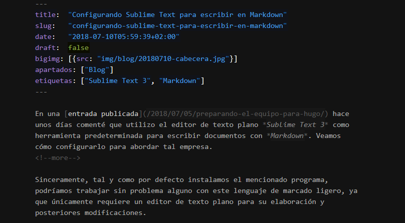

En una [entrada publicada](/blog/preparando-el-equipo-para-hugo/) hace unos
días, comenté que utilizo el editor de texto plano _Sublime Text 3_ como
herramienta predeterminada para escribir documentos con _Markdown_. Veamos cómo
configurarlo para abordar tal empresa.

Sinceramente, tal y como por defecto instalamos el mencionado programa,
podríamos trabajar sin problema alguno con este lenguaje de marcado ligero, ya
que únicamente requiere un editor de texto plano para su elaboración y
posteriores modificaciones.

No obstante, existe un paquete que mejora la experiencia de edición de manera
considerable: `Markdown Editing`. Al abrir cualquier fichero redactado
utilizando el mencionado lenguaje de marcado, su contenido se centra en
pantalla, facilitando así enormemente su lectura. Además, elementos como
títulos, cursivas, negritas, enlaces o código quedan resaltados de forma muy
agradable.

Para muestra, un botón:

Si a todo ello le añadimos el modo sin distracciones que incorpora _Sublime Text
3_, al que se accede mediante la combinación de teclas `Shift + F11`, el
resultado es una cómoda herramienta que permite generar documentos con
_Markdown_ eficientemente.

El procedimiento a seguir es el habitual a la hora de incorporar un nuevo
paquete a _Sublime Text 3_:

1. Si todavía no tenemos el complemento que permite instalar paquetes
   fácilmente, abrimos [este enlace](https://packagecontrol.io/installation) y
   copiamos el bloque de instrucciones que figura en el cuadro asociado a la
   versión de _Sublime Text_ que utilicemos (a día de hoy, seguramente, será la
   3).
2. Abrimos la consola de _Sublime Text 3_, haciendo clic en el apartado
   `Show Console` del menú `View` (o utilizando su atajo de teclado asociado).
   En la ventana que aparece dentro del editor, pegamos el texto copiado durante
   el primer paso y pulsamos enter.
3. Hacemos uso ahora del atajo de teclado `Ctrl + Shift + P` y empezamos a
   escribir `install`, hasta que quede resaltada la opción
   `Package Control: Install Package` y después pulsamos enter.
4. A continuación, comenzamos a escribir `markdown` y utilizamos los cursores
   para seleccionar el paquete `MarkdownEditing`, pulsando de nuevo enter una
   vez lo hayamos conseguido.

De esta forma, basta ahora con que abramos en _Sublime Text 3_ cualquier archivo
escrito con _Markdown_ y experimentaremos los cambios estéticos que comentaba al
principio de este artículo.

Personalmente, el esquema de colores que este paquete incorpora por defecto no
me hace excesiva ilusión, acostumbrado como estoy a _Monokai_. Sin embargo,
podemos seleccionar un tema oscuro desde el menú `Preferences`, apartado
`Package Settings`, subapartado `Markdown Editing`, accediendo a
`Change color scheme...` y escogiendo la opción `Dark`.

Finalmente, por si fuera de interés, me gustaría destacar que también existen
diversos paquetes que ofrecen la opción de previsualizar el documento que
estamos redactando y refrescar el resultado cuando llevamos a cabo cualquier
tipo de edición en él. No he entrado en detalles sobre ellos en este artículo
simplemente porque utilizo un método diferente para llevar a cabo las
mencionadas acciones.
