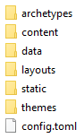
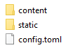

¡Ha llegado el momento que todos estábamos esperando! Tras un par de artículos
en los que hemos preparado nuestros equipos instalando las herramientas
necesarias, hoy veremos cómo generar nuestro primer sitio web con _Hugo_.

Esta tercera entrada, catalogada bajo la etiqueta [Metablog](/tags/metablog/),
se va a apoyar en la guía de inicio recogida en la documentación oficial de
_Hugo_, a la que podemos acceder a través de
[este enlace](https://gohugo.io/getting-started/quick-start/).

En primer lugar, abrimos la terminal _Git Bash_ y nos dirigimos al directorio de
nuestro disco duro donde tengamos pensado almacenar localmente el sitio web. En
la mencionada guía recomiendan ubicar las páginas en la ruta `C:\Hugo\Sites\`,
aunque ya comenté en la
[anterior entrada](/2018/07/08/instalando-hugo-en-windows/) que no era
estrictamente necesario proceder de tal forma.

Dicho esto, en este artículo seguiremos al dedillo las indicaciones dadas en la
guía, de manera que en la terminal tecleamos:

```
cd c:/Hugo/Sites/
```

El comando para generar un nuevo sitio web es `hugo new site [path] [flags]`,
donde sustituiremos `[path]` por la ruta al directorio donde almacenaremos
nuestra página web. Por lo que respecta a las `[flags]`, en el apartado de la
documentación oficial dedicado a
[hugo new site](https://gohugo.io/commands/hugo_new_site/) tenemos el listado de
las disponibles. No obstante, para una primera toma de contacto, no añadiremos
ninguna de ellas.

Así pues, generemos un primer sitio de prueba y, en un alarde de extrema
originalidad, ubiquémoslo en el directorio `\prueba\`. Para ello, escribimos en
la terminal:

```
hugo new site prueba
```

Recibimos entonces un mensaje de felicitación (en caso contrario, convendría que
revisáramos la instalación de _Hugo_ siguiendo las indicaciones de
[esta entrada](/blog/instalando-hugo-en-windows/)) y algunas instrucciones
relacionadas con el uso de temas, la creación de contenidos y el acceso local al
sitio web.

_Hugo_ ha creado el directorio `\prueba\` en el interior de la ruta donde hemos
ejecutado el comando `hugo new site`. Además, ha poblado el mismo con algunas
carpetas (vacías en su mayor parte), quedando una estructura como la que figura
en la siguiente imagen:



En un futuro exploraremos con detalle el cometido de algunos de esos directorios
que aparecen en la imagen (`\content\` y `\layouts\` son de extrema importancia,
así como ese curioso archivo denominado `config.toml`). No obstante, por el
momento, evitemos distraernos en exceso y sigamos las indicaciones de la guía.

Volvemos a la terminal, nos movemos hacia el directorio `\prueba\` e iniciamos
un repositorio _Git_, acciones que requieren teclear los dos siguientes
comandos:

```
cd prueba
```

```
git init
```

En el siguiente paso de la guía nos invitan a instalar un tema para la web,
[Ananke](https://themes.gohugo.io/gohugo-theme-ananke/), utilizando `submodule`
(un comando de _Git_). No obstante, en este momento, me voy a desviar de las
indicaciones dadas y optar por un método diferente de instalación de temas. A
continuación, nos moveremos a la carpeta `\themes\` y clonaremos en nuestro
disco duro el propio repositorio del tema. Para ello, escribimos en la terminal:

```
cd themes
```

```
git clone https://github.com/budparr/gohugo-theme-ananke.git
```

De esta manera, tenemos acceso localmente a un sitio web de prueba, con un poco
de contenido ya generado, que nos permitirá hacernos una idea del aspecto final
de nuestro sitio web utilizando el tema _Ananke_. Aunque soy consciente de que
me estoy desviando ''ligeramente'' de la guía oficial, vamos a tomar esta senda
para ver cómo luce nuestro sitio web.

Abrimos el explorador de archivos de _Windows_ y en el directorio donde hemos
ubicado la página web (`C:\Hugo\Sites\prueba\`) accedemos a la carpeta `themes`.
Una vez dentro de ella, hacemos doble clic sobre el directorio
`gohugo-theme-ananke` y repetimos luego la acción con la carpeta denomiada
`exampleSite`, cuyos contenidos son:



Copiamos tanto las dos carpetas, como el archivo `config.toml`, y pegamos todo
en el directorio `C:\Hugo\Sites\prueba\`, reemplazando los ficheros existentes
con el mismo nombre que en él se encuentran.

Ahora volvemos a la terminal, que todavía está apuntando a la carpeta `\themes\`
y tecleamos

```
cd ..
```

para volver al directorio raíz de nuestro sitio web. A continuación, para
revisar el sitio web localmente escribimos

```
hugo server
```

y, para mi sorpresa, recibimos el siguiente mensaje de error
`Error: Unable to find theme Directory: C:\Hugo\gohugo-theme-ananke`, hecho que
debe ser el _karma_ haciendo acto de presencia por haberme desviado de las
indicaciones de la guía oficial.

Aunque no quería meterme en este artículo en el contenido del archivo
`config.toml`, para evitar ofrecer mucha información de golpe, solucionemos
rápidamente este pequeño _bug_ para así poder revisar localmente el sitio web.

Hacemos clic derecho sobre el mencionado fichero y lo abrimos con _Sublime
Text_. Modificamos la quinta línea que aparece, de

```toml
themesDir = "../.."
```

a

```toml
# themesDir = "../.."
```

y guardamos los cambios.

Volvemos ahora a la terminal y tecleamos de nuevo

```
hugo server
```

Tras recibir cierta información sobre el sitio, únicamente nos resta abrir
nuestro navegador web favorito y en la barra de direcciones escribir
`http://localhost:1313/`, accediendo así a la página de bienvenida de nuestro
sitio web, que luce así de bien:


Es el momento de navegar por la página, estudiar si nos complace estéticamente y
comprobar si la manera en la que se organizan los contenidos es la apropiada
para el sitio web que teníamos en mente. Cuando hayamos terminado el paseo,
volvemos a la terminal y cerramos el servidor local utilizando la combinación de
teclas `Ctrl + C`.

En el próximo artículo catalogado bajo la etiqueta [Metablog](/tags/metablog/)
exploraremos, ahora sí y con mucho más detalle, la configuración básica del
sitio web, que reside en el fichero `config.toml`.
