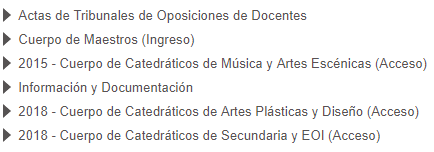

Opino que una buena manera de encarar unas oposiciones pasa por revisar
concienzudamente los criterios de evaluación adoptados en anteriores
convocatorias. Echemos un vistazo en este artículo a los seguidos en la última.

El primer problema que encontramos reside en el acceso a la información de
interés. Si acudimos a la sección de
[oposiciones](http://www.ceice.gva.es/es/web/rrhh-educacion/oposiciones) de la
página web de la _Conselleria d' Educació, Investigació, Cultura i Esport_ de la
_Generalitat Valenciana_, a la hora de escribir estas líneas, tenemos acceso los
apartados que figuran en la siguiente imagen:

Como podemos comprobar rápidamente, no aparece sección alguna dedicada al Cuerpo
de Profesores de Enseñanza Secundaria, que sería aquella de nuestro interés. No
obstante, el portal sí conserva una copia de los criterios de evaluación que se
adoptaron para las últimas oposiciones en la especialidad de matemáticas, aunque
he sido incapaz de acceder a ellos a través de los diferentes menús que ofrece
el sitio web.

El documento se titula "_Criterios de evaluación del procedimiento selectivo de
ingreso en el cuerpo de profesores de enseñanza de secundaria, especialidad de
matemáticas_" y entonces, conociendo este dato, basta una búsqueda rápida en
_Google_ para encontrar
[el enlace](http://www.ceice.gva.es/documents/162909733/163272656/sec_ing_cri_206.pdf/c375ea04-4e6f-4b2f-8d5f-9117de6d434b)
que nos permite su consulta.

En la segunda página de este recurso encontramos los elementos que se valorarán
asociados con la redacción del tema y son:

1. Estructura del tema.
    - Presenta un índice.
    - Justifica la importancia del tema.
    - Hace una introducción del mismo.
    - Las distintas partes están compensadas en extensión según su importancia.
    - Elabora una conclusión acorde con el planteamiento del tema.
2. Contenidos específicos.
    - Adapta los contenidos al tema y desarrolla todos los apartados expresados
      en el título del tema.
    - Secuencia de manera lógica y clara sus apartados.
    - Argumenta los contenidos.
    - Profundiza en los mismos, siendo la información de cada parte lo más
      completa y exhaustiva posible.
    - No existen errores de contenido o concepto.
    - Relaciona el tema elegido con otros temas.
3. Expresión.
    - Muestra fluidez en la redacción.
    - Hace un uso adecuado del lenguaje, con una correcta ortografía y una buena
      construcción sintáctica.
    - Emplea terminología científica amplia y adecuada al tema tratado.
4. Presentación.
    - Presenta un escrito con limpieza y claridad.
    - Deberá limitarse a la lectura de lo escrito.
5. Bibliografía / documentación.
    - Fundamenta los contenidos con autores o bibliografías.
    - Las fuentes y/o bases de datos utilizados están actualizadas.

El anterior listado nos puede, e incluso me atrevería a decir que nos debe,
orientar de cara a la elaboración de nuestros temas, o bien puede ser un factor
que nos decante por uno u otro temario de cara a su adquisición y futura
revisión personal.

Por otro lado, echo en falta una rúbrica detallada, con sus indicadores de logro
y las correspondientes ponderaciones para cada una de las variables arriba
recogidas. Sinceramente, en algunos puntos no termina de quedarme claro cómo se
procederá a la evaluación.

Cambiando de tercio, por lo que respecta a la resolución de problemas, la
información todavía es más escueta, apenas cinco líneas relegadas al final de la
tercera página del documento:

- Resolución de problemas.
    - Desarrollo y resultado correcto en problemas y cuestiones.
    - Explica el método de resolución.
    - Rigurosidad matemática.
    - Demuestra originalidad y destreza en la solución de las cuestiones.

Al igual que antes, aunque tenemos acceso a aquello que se valorará, en algunos
puntos me es difícil imaginar cómo se procederá a su evaluación. La
originalidad, destreza y rigurosidad me parecen atributos complicados de
cuantificar y fuertemente sujetos a la subjetividad de quien examina.

En cuanto a la defensa de la programación docente, me atrevería a decir que no
encontramos demasiadas sorpresas aquí y nuestra labor se limita a exponer, uno
por uno, los apartados que en la convocatoria exigen que contenga. Así pues,
valorarán:

1. Estructura de la programación. - Contextualiza y justifica la programación en
   el marco legal y la realidad escolar. - Se adapta al nivel y/o alumnado
   elegido. - Está claramente estructurada y hace mención a las unidades
   didácticas programadas.
2. Elementos de la programación.
    - Desarrolla y adapta los elementos básicos del currículum: objetivos,
      contenidos y criterios de evaluación. Se expondrán con claridad y serán
      adecuados al nivel elegido.
    - Hace referencia a las competencias básicas si la programación es de ESO.
    - Realiza una buena secuenciación y temporalización de los contenidos.
    - Desarrolla una metodología adecuada: estrategias y principios
      metodológicos claros y concisos.
    - Se expresarán y justificarán los criterios y procedimientos de evaluación
      y calificación así como los mecanismos de refuerzo y recuperación.
    - Se tendrá en cuenta la utilización en la programación de otros aspectos
      educativos como: el uso de las TIC, fomento de la lectura, relación con
      las familias...
    - Se marcarán las medidas específicas de atención a la diversidad.
    - Mostrará originalidad e individualidad.
    - Usa mecanismos de autoevaluación de la actividad docente.
3. Expresión y exposición oral.
    - Muestra seguridad y coherencia en la exposición.
    - Hace un uso correcto del lenguaje, siendo fluido, rico y variado.
    - Capta la atención con un discurso ameno.
    - Deberá ser equilibrada en los tiempos.
    - La presentación consistirá en la defensa de la misma y no una mera
      repetición de lo escrito.
4. Bibliografía. Documentación.
    - Toma como referencia la normativa vigente.
    - Hace alusión a autores y bibliografía.

Especial atención merece el tercer punto, que no deja apenas margen para la
improvisación. Esta parte requiere una preparación exhaustiva, que maneje los
tiempos de manera adecuada y nos proporcione seguridad vía repetición _ad
infinitum_ de la defensa.

Finalmente, por lo que respecta a la defensa de la unidad didáctica, se
valorara:

1. Estructura de la unidad didáctica.
    - Se ajusta a los requisitos de la convocatoria.
    - Contextualiza y justifica la unidad en el marco legal y en la realidad
      escolar.
    - Se adapta al nivel y/o alumnado elegido.
    - Desarrolla y adapta los elementos básicos de la unidad didáctica.
    - Tiene en cuenta las necesidades específicas de apoyo educativo del
      alumnado.
2. Elementos de la unidad didáctica.
    - Competencias básicas –sólo en ESO.
    - Objetivos y contenidos de aprendizaje. Estarán claramente formulados, con
      coherencia y serán adecuados al nivel y al momento concreto del curso
      escolar elegido.
    - Actividades de enseñanza y aprendizaje. Serán motivadoras, variadas,
      graduadas en dificultad y accesibles a la mayoría del alumnado.
    - Procedimientos y criterios de evaluación. Flexibilidad y adaptación a la
      diversidad del alumnado. Mecanismos de recuperación.
    - Atención a la diversidad.
    - Utilización de nuevas tecnologías.
3. Expresión y exposición oral.
    - Muestra seguridad y coherencia en la exposición.
    - Hace un uso correcto del lenguaje, siendo fluido, rico y variado.
    - Capta la atención con un discurso ameno.
    - Utiliza material auxiliar sin contenido curricular y recursos didácticos
      (pizarra, ilustraciones, diagramas, mapas, esquemas, multimedia, TIC.)
4. Bibliografía. Documentación.
    - Toma como referencia la normativa vigente.
    - Hace alusión a autores y bibliografía.

El documento concluye detallando la fase de concurso, de escaso interés para la
temática de este artículo.

Así pues, sabiendo qué se espera de nosotros, podemos organizar el desarrollo de
cada una de las partes de manera adecuada. Si bien es cierto que estos criterios
de evaluación corresponden a los de la última convocatoria, no sería
descabellado suponer que la mayoría de ellos se extrapolarán a la siguiente. En
cualquier caso, podemos echar un rápido vistazo a los asociados a la
convocatoria de este año para el Cuerpo de Maestros y comprobar que aquellos
definidos para Educación Primaria no distan sobremanera de los listados arriba.
