### 1. Interfaces Gráficas I

#### 1.1. Vídeo



#### 1.2. Notas personales

En esta lección, comenzamos el estudio de las **interfaces gráficas** en
_Python_, analizando para ello la librería `Tkinter`. Las interfaces gráficas,
también denominadas GUI, son intermediarios entre el programa y el usuario.
Están formadas por un conjunto de gráficos como ventanas, botones, menús,
casillas de verificación, etc.

Además de la mencionada, existen otras librerías alternativas para trabajar con
interfaces gráficas:

- `WxPython`
- `PyQT`
- `PyGTK`

`Tkinter` es un ''puente'' entre _Python_ y la librería `TCL / TK`.

La estructura de una interfaz gráfica en _Python_ es:

- _Raíz_: la ventana de la aplicación propiamente dicha.
- _Frame_: estructura que agrupa diversos elementos.
- _Widgets_: elementos de la aplicación. En ocasiones, al _frame_ también se le
  considera un _widget_ más.

A continuación, veamos cómo construir la raíz:

```python
from tkinter import Tk

raiz = Tk()

raiz.mainloop()
```

Al ejecutar el anterior bloque de código aparece una ventana en blanco en
nuestro escritorio, con algunos botones que permiten interactuar con ella a la
manera que estamos habituados.

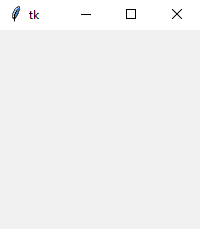

Para que una ventana pueda mantenerse en ejecución, debe estar en una especie de
''bucle infinito'' (a la espera o escucha de eventos), estado que conseguimos a
través de la función `mainloop()`, que, por el momento, habrá de estar siempre
al final de nuestros programas.

La documentación para la librería `Tkinter` la podemos encontrar siguiendo
[este enlace](https://docs.python.org/3/library/tk.html).

Modifiquemos algunas de las características que esta ventana posee por defecto:

```python
from tkinter import Tk

raiz = Tk()

raiz.title("Ventana de pruebas")
raiz.resizable(width=False, height=False)  # raiz.resizable(0, 0)
raiz.iconbitmap("icon.ico")
raiz.geometry("450x300")
raiz.config(bg="lightblue")
raiz.mainloop()
```

_Notas_:

- `title()` nos permite cambiar el título de la ventana generada.
- `resizable()` acepta dos valores booleanos para indicar si permitimos que se
  modifique la anchura o la altura de la ventana. Según los argumentos
  escogidos, incluso queda deshabilitado el botón de maximizar ventana.
- `iconbitmap()` nos da la posibilidad de cambiar el icono de la ventana
  generada, que, por defecto, es una especie de pluma. Para ello, hemos de
  almacenar en el directorio de la aplicación (o tener bien localizada su ruta)
  un archivo de extensión `.ico` (buscar en _Google_ ''conversor .ico'' para
  acceder a aplicaciones online que nos generen este tipo de ficheros).
- `geometry()` configura el ancho y el alto de la ventana.
- `config()`, entre otras acciones, nos permite cambiar el color del fondo.

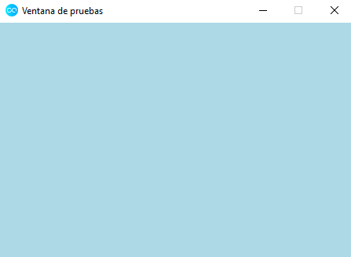

Hasta el momento, las ventanas requieren de la consola de _Python_ para su
funcionamiento. Si queremos que este sea independiente de ella, hemos de
modificar la extensión de la aplicación de `.py` a `.pyw`.

### 2. Interfaces Gráficas II

#### 2.1. Vídeo



#### 2.2. Notas personales

Después de introducir, en la lección anterior, la _raíz_ de una interfaz
gráfica, en esta abordaremos la construcción y uso de _frames_. Comencemos
recuperando el código fuente de la ''aplicación'' que generamos con
anterioridad:

```python
from tkinter import Tk

raiz = Tk()

raiz.title("Ventana de pruebas")
raiz.resizable(width=False, height=False)  # raiz.resizable(0, 0)
raiz.iconbitmap("icon.ico")
raiz.geometry("450x300")
raiz.config(bg="lightblue")
raiz.mainloop()
```

A continuación, crearemos un frame y lo empaquetaremos (ubicaremos) dentro de la
raíz disponible a través del método `pack()`. Además, prescindiremos de la
instrucción `raiz.geometry()`, para así estar en condiciones de configurar el
tamaño del _frame_ (la raíz se adaptará automáticamente al tamaño de sus
elementos internos):

```python
from tkinter import Tk, Frame

raiz = Tk()

raiz.title("Ventana de pruebas")
raiz.resizable(width=True, height=True)
raiz.iconbitmap("icon.ico")
raiz.config(bg="lightblue")

frame = Frame()
frame.pack()
frame.config(bg="tomato", width="450", height="300")

raiz.mainloop()
```

A primera vista, al ejecutar el aterior bloque de código, da la sensación de que
hemos perdido el color de fondo declarado para la aplicación (`lightblue`). No
obstante, como ahora permitimos manipular el tamaño de la ventana (mediante la
instrucción `raiz.resizable(width=True, height=True)`), al agrandarla
comprobamos que todo funciona correctamente.

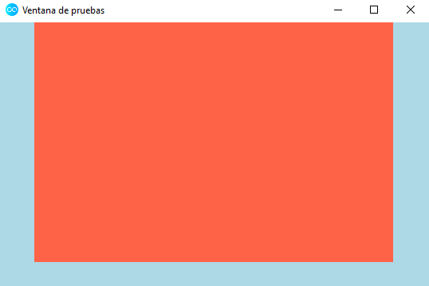

_Nota_: en
[esta página](http://www.science.smith.edu/dftwiki/index.php/Color_Charts_for_TKinter)
podemos encontrar un buen recurso para acceder a una paleta de colores
declarados por nombres y disponibles para la librería `tkinter`.

Por otro lado, observamos que el _frame_ tiene un tamaño fijo, por mucho que
manipulemos el tamaño de la ventana, las dimensiones del _frame_ no se alteran,
así como su posición, que permanece centrada en la parte superior de la ventana
de la aplicación. Este comportamiento es el dado por defecto, que podemos
configurar de manera diferente, si así lo deseamos, a través del método
`pack()`.

```python
from tkinter import Tk, Frame

raiz = Tk()

raiz.title("Ventana de pruebas")
raiz.resizable(width=True, height=True)
raiz.iconbitmap("icon.ico")
raiz.config(bg="lightblue")

frame = Frame()
frame.pack(side="left", anchor="s", fill="x", expand="True")
frame.config(bg="tomato", width="450", height="300")

raiz.mainloop()
```

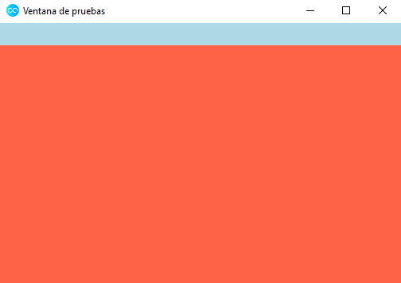

Las opciones de configuración de los _frames_ son ciertamente numerosas. Por
ejemplo, podemos añadirle un borde (parámetros `bd` y `relief`) o cambiar el
icono del ratón cuando se adentra en el interior del _frame_ (parámetro
`cursor`):

```python
from tkinter import Tk, Frame

raiz = Tk()

raiz.title("Ventana de pruebas")
raiz.resizable(width=True, height=True)
raiz.iconbitmap("icon.ico")
raiz.config(bg="lightblue")

frame = Frame()
frame.pack(side="left", anchor="s")
frame.config(bg="tomato",
             width="450",
             height="300",
             bd=35,
             relief="groove",
             cursor="pirate")

raiz.mainloop()
```

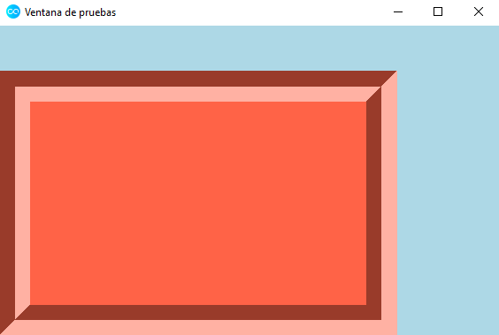

Obviamente, todo aquello que hemos visto de cara a configurar un _frame_ es
aplicable a la propia _raíz_ y dependerá de cómo deseemos diseñar nuestra
aplicación.

### 3. Interfaces Gráficas III

#### 3.1. Vídeo



#### 3.2. Notas personales

En esta lección, analizaremos cómo trabajar con el _widget_ `Label`,
perteneciente a la librería `tkinter`, que nos permite mostrar texto o imágenes
en nuestras interfaces gráficas. No es un elemento con el que podamos
interactuar, es decir, no podremos borrarlo, arrastrarlo, etc.

Su sintaxis es:

```python
variable = Label(contenedor, opciones)
```

En [esta página](http://effbot.org/tkinterbook/label.htm) podemos consultar qué
opciones disponibles ofrece el _widget_ `Label`.

Para ver en acción este _widget_, reutilicemos como base parte del código
generado en lecciones anteriores:

```python
from tkinter import Tk, Frame

root = Tk()

root.title("Probando el widget Label")
root.resizable(width=True, height=True)
root.iconbitmap("icon.ico")
root.config(bg="lightblue")

frame = Frame(root, width=500, height=400)

frame.pack()

root.mainloop()
```

Añadimos ahora, antes de la instrucción `root.mainloop()`, las líneas de código:

```python
label = Label(frame, text="Mi primera etiqueta.")
label.pack()
```

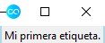

Quedando el resultado de la ejecución como una ventana bastante reducida porque,
recordemos, la raíz se adapta al tamaño de sus elementos integrados (aunque le
hayamos indicado ciertas dimensiones previamente). Ello se debe al uso del
método `pack()`. Veamos el efecto que produce utilizar la función `place()` en
su lugar, pasándole las coordenadas donde deseamos situar el _widget_:

```python
from tkinter import Tk, Frame, Label

root = Tk()

root.title("Probando el widget Label")
root.resizable(width=True, height=True)
root.iconbitmap("icon.ico")
root.config(bg="lightblue")

frame = Frame(root, width=500, height=400)

frame.pack()

label = Label(frame, text="Mi primera etiqueta.")
label.place(x=100, y=200)

root.mainloop()
```

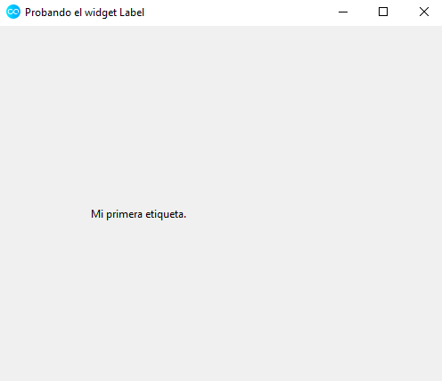

_Nota_: _Python_ utiliza un curioso sistema de coordenadas. La coordenada `x`
indica la distancia horizontal al comienzo del _widget_ tal como estamos
acostumbrados en matemáticas. Sin embargo, la coordenada `y` indica la distancia
vertical al comienzo del _widget_ tomando como referencia la parte superior de
la ventana y siendo los valores positivos desplazamientos hacia abajo.

Si no vamos a utilizar en ningún momento la variable `label`, podemos aligerar
un tanto el código escribiendo:

```python
from tkinter import Tk, Frame, Label

root = Tk()

root.title("Probando el widget Label")
root.resizable(width=True, height=True)
root.iconbitmap("icon.ico")
root.config(bg="lightblue")

frame = Frame(root, width=500, height=400)

frame.pack()

Label(frame, text="Mi primera etiqueta.").place(x=100, y=200)

root.mainloop()
```

A partir de aquí, ya únicamente nos queda experimentar con las diferentes
opciones asociadas al _widget_ `Label`:

```python
from tkinter import Tk, Frame, Label

root = Tk()

root.title("Probando el widget Label")
root.resizable(width=True, height=True)
root.iconbitmap("icon.ico")
root.config(bg="lightblue")

frame = Frame(root, width=500, height=400)

frame.pack()

Label(frame, text="Mi primera etiqueta.", fg="tomato",
      font=("Arial", 18)).place(x=100, y=200)

root.mainloop()
```

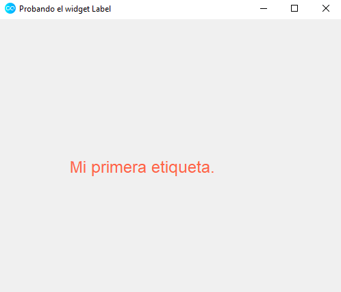

Adicionalmente, el _widget_ `Label` nos permite incluir (de forma nativa en la
librería `tkinter`) imágenes de tipo _gif_ o _png_. Por ejemplo, insertemos en
nuestra aplicación [esta imagen](https://www.freepng.es/png-lwhgke/), que, en un
alarde de originalidad, llamaremos `avengers.png`:

```python
from tkinter import Tk, Frame, Label, PhotoImage

root = Tk()

root.title("Probando el widget Label")
root.resizable(width=True, height=True)
root.iconbitmap("icon.ico")
root.config(bg="lightblue")

frame = Frame(root, width=500, height=400)

frame.pack()

imagen = PhotoImage(file="avengers.png")

Label(frame, image=imagen).pack()  # .place() es otra posibilidad

root.mainloop()
```

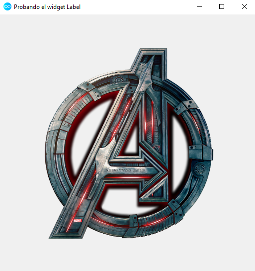

_Nota_: para que la ventana se adaptase automáticamente al tamaño de la imagen
descargada, he utilizado el método `pack()` en lugar de la función `place()`. No
obstante, con ambas opciones se puede conseguir el mismo resultado si ajustamos
de manera fina sus correspondientes opciones.

### 4. Interfaces Gráficas IV

#### 4.1. Vídeo



#### 4.2. Notas personales

En esta lección, tras haber estudiado en la anterior el _widget_ `Label`,
abordaremos el uso del _widget_ `Entry`, cuyo funcionamento es realmente similar
a nivel de sintaxis. Este último habilita, en nuestras ventanas, la posibilidad
de introducir un cuadro de texto, desde el cual el usuario puede suministrar
cierta información.

```python
from tkinter import Tk, Entry

root = Tk()

root.title("Probando el widget Entry")
root.resizable(width=True, height=True)
root.iconbitmap("icon.ico")
root.config(bg="lightblue")

cuadro_texto = Entry(root)
cuadro_texto.pack()

root.mainloop()
```

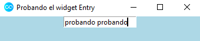

A partir de ahora, podemos reutilizar los conceptos y propiedades aprendidas
hasta el momento:

```python
from tkinter import Tk, Frame, Entry

root = Tk()

root.title("Probando el widget Entry")
root.resizable(width=True, height=True)
root.iconbitmap("icon.ico")
root.config(bg="lightblue")

frame = Frame(root, width=450, height=300)
frame.pack()

cuadro_texto = Entry(frame)
cuadro_texto.place(x=100, y=100)

root.mainloop()
```

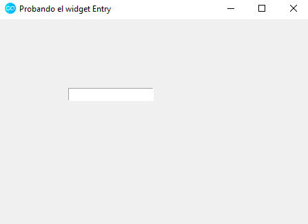

Empecemos a combinar _widgets_ añadiendo al lado del cuadro de texto una
etiqueta que rece ''Nombre:'', como si quisiéramos elaborar un formulario de
registro de datos personales. Utilizando la función `place()` es posible, pero
resulta muy complicado cuadrar adecuadamente todos los espacios de la ventana de
la aplicación.

Existen dos alternativas a la hora de abordar esta situación:

- `pack()`, aunque ya sabemos que después se ajustará la ventana al tamaño de
  sus elementos internos, ignorando pues las dimensiones que establecimos en su
  declaración.
- `grid()`, construye una tabla dentro de la interfaz gráfica con tantas filas y
  columnas como nosotros queramos. Tras ello, podemos ubicar en la casilla que
  deseemos el elemento que nos interese.

Estudiemos el uso de esta última función mencionada:

```python
from tkinter import Tk, Frame, Entry, Label

root = Tk()

root.title("Probando el widget Entry")
root.resizable(width=True, height=True)
root.iconbitmap("icon.ico")
root.config(bg="lightblue")

frame = Frame(root, width=450, height=300)
frame.pack()

nombre_label = Label(frame, text="Nombre:")
nombre_label.grid(row=0, column=0)

cuadro_nombre = Entry(frame)
cuadro_nombre.grid(row=0, column=1)

apellido_label = Label(frame, text="Apellido:")
apellido_label.grid(row=1, column=0)

apellido_texto = Entry(frame)
apellido_texto.grid(row=1, column=1)

direccion_label = Label(frame, text="Dirección:")
direccion_label.grid(row=2, column=0)

direccion_texto = Entry(frame)
direccion_texto.grid(row=2, column=1)

root.mainloop()
```

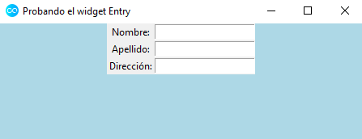

Por defecto, los elementos se alinean centrados dentro de su correspondiente
casilla de la rejilla. Con el parámetro `sticky` y los cuatro puntos cardinales
(`n`, `e`, `s`, `w` y sus combinaciones por parejas) podemos modificar dicho
comportamiento.

```python
from tkinter import Tk, Frame, Entry, Label

root = Tk()

root.title("Probando el widget Entry")
root.resizable(width=True, height=True)
root.iconbitmap("icon.ico")
root.config(bg="lightblue")

frame = Frame(root, width=450, height=300)
frame.pack()

nombre_label = Label(frame, text="Nombre:")
nombre_label.grid(row=0, column=0, sticky="e")

cuadro_nombre = Entry(frame)
cuadro_nombre.grid(row=0, column=1)

apellido_label = Label(frame, text="Apellido:")
apellido_label.grid(row=1, column=0, sticky="e")

apellido_texto = Entry(frame)
apellido_texto.grid(row=1, column=1)

direccion_label = Label(frame, text="Dirección:")
direccion_label.grid(row=2, column=0, sticky="e")

direccion_texto = Entry(frame)
direccion_texto.grid(row=2, column=1)

tfno_label = Label(frame, text="Teléfono (fijo):")
tfno_label.grid(row=3, column=0, sticky="e")

tfno_texto = Entry(frame)
tfno_texto.grid(row=3, column=1)

movil_label = Label(frame, text="Teléfono (móvil):")
movil_label.grid(row=4, column=0, sticky="e")

movil_texto = Entry(frame)
movil_texto.grid(row=4, column=1)

root.mainloop()
```

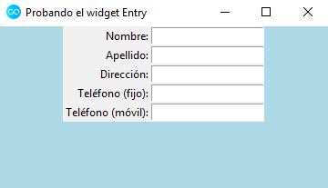

Para evitar que los elementos aparezcan tan juntos, los parámetros `padx` y
`pady` pueden resultarnos de utilidad, ya que nos permiten configurar la
distancia del elemento al límite del contenedor donde se haya ubicado.

```python
from tkinter import Tk, Frame, Entry, Label

root = Tk()

root.title("Probando el widget Entry")
root.resizable(width=True, height=True)
root.iconbitmap("icon.ico")
root.config(bg="lightblue")

frame = Frame(root, width=450, height=300)
frame.pack()

nombre_label = Label(frame, text="Nombre:")
nombre_label.grid(row=0, column=0, sticky="e", padx=2, pady=2)

cuadro_nombre = Entry(frame)
cuadro_nombre.grid(row=0, column=1, padx=2, pady=2)

apellido_label = Label(frame, text="Apellido:")
apellido_label.grid(row=1, column=0, sticky="e", padx=2, pady=2)

apellido_texto = Entry(frame)
apellido_texto.grid(row=1, column=1, padx=2, pady=2)

direccion_label = Label(frame, text="Dirección:")
direccion_label.grid(row=2, column=0, sticky="e", padx=2, pady=2)

direccion_texto = Entry(frame)
direccion_texto.grid(row=2, column=1, padx=2, pady=2)

tfno_label = Label(frame, text="Teléfono (fijo):")
tfno_label.grid(row=3, column=0, sticky="e", padx=2, pady=2)

tfno_texto = Entry(frame)
tfno_texto.grid(row=3, column=1, padx=2, pady=2)

movil_label = Label(frame, text="Teléfono (móvil):")
movil_label.grid(row=4, column=0, sticky="e")

movil_texto = Entry(frame)
movil_texto.grid(row=4, column=1)

root.mainloop()
```

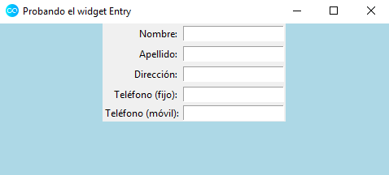

Ahora, ya únicamente nos resta experimentar con la configuración de los
distintos _widgets_ estudiados, empleando para ello principalmente la función
`config()` asociada a cada _widget_.

Finalmente, veamos cómo añadir un cuadro de texto que nos permita introducir
contraseñas. Buscamos que al suministrar la información, esta aparezca
''oculta'' tras asteriscos. El parámetro `show` de la función `config()` cumple
dicho cometido:

```python
from tkinter import Tk, Frame, Entry, Label

root = Tk()

root.title("Probando el widget Entry")
root.resizable(width=True, height=True)
root.iconbitmap("icon.ico")
root.config(bg="lightblue")

frame = Frame(root, width=450, height=300)
frame.pack()

nombre_label = Label(frame, text="Nombre:")
nombre_label.grid(row=0, column=0, sticky="e", padx=2, pady=2)

cuadro_nombre = Entry(frame)
cuadro_nombre.grid(row=0, column=1, padx=2, pady=2)

apellido_label = Label(frame, text="Apellido:")
apellido_label.grid(row=1, column=0, sticky="e", padx=2, pady=2)

apellido_texto = Entry(frame)
apellido_texto.grid(row=1, column=1, padx=2, pady=2)

direccion_label = Label(frame, text="Dirección:")
direccion_label.grid(row=2, column=0, sticky="e", padx=2, pady=2)

direccion_texto = Entry(frame)
direccion_texto.grid(row=2, column=1, padx=2, pady=2)

tfno_label = Label(frame, text="Teléfono (fijo):")
tfno_label.grid(row=3, column=0, sticky="e", padx=2, pady=2)

tfno_texto = Entry(frame)
tfno_texto.grid(row=3, column=1, padx=2, pady=2)

movil_label = Label(frame, text="Teléfono (móvil):")
movil_label.grid(row=4, column=0, sticky="e")

movil_texto = Entry(frame)
movil_texto.grid(row=4, column=1)

pass_label = Label(frame, text="Constraseña:")
pass_label.grid(row=5, column=0, sticky="e")

pass_texto = Entry(frame)
pass_texto.grid(row=5, column=1)
pass_texto.config(show="*")

root.mainloop()
```

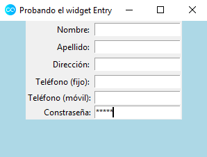

### 5. Interfaces Gráficas V

#### 5.1. Vídeo



#### 5.2. Notas personales

En esta lección, presentaremos dos _widgets_ nuevos: `Text` y `Button`. El
primero de ellos nos permite introducir un texto de extensión considerable en un
cuadro, mientras que el segundo simplemente se trata de la clase asociada a los
botones que habitualmente pulsamos en cualquier aplicación.

Retomemos el último ejemplo de la lección anterior:

```python
from tkinter import Tk, Frame, Entry, Label

root = Tk()

root.title("Probando el widget Entry")
root.resizable(width=True, height=True)
root.iconbitmap("icon.ico")
root.config(bg="lightblue")

frame = Frame(root, width=450, height=300)
frame.pack()

nombre_label = Label(frame, text="Nombre:")
nombre_label.grid(row=0, column=0, sticky="e", padx=2, pady=2)

cuadro_nombre = Entry(frame)
cuadro_nombre.grid(row=0, column=1, padx=2, pady=2)

apellido_label = Label(frame, text="Apellido:")
apellido_label.grid(row=1, column=0, sticky="e", padx=2, pady=2)

apellido_texto = Entry(frame)
apellido_texto.grid(row=1, column=1, padx=2, pady=2)

direccion_label = Label(frame, text="Dirección:")
direccion_label.grid(row=2, column=0, sticky="e", padx=2, pady=2)

direccion_texto = Entry(frame)
direccion_texto.grid(row=2, column=1, padx=2, pady=2)

tfno_label = Label(frame, text="Teléfono (fijo):")
tfno_label.grid(row=3, column=0, sticky="e", padx=2, pady=2)

tfno_texto = Entry(frame)
tfno_texto.grid(row=3, column=1, padx=2, pady=2)

movil_label = Label(frame, text="Teléfono (móvil):")
movil_label.grid(row=4, column=0, sticky="e")

movil_texto = Entry(frame)
movil_texto.grid(row=4, column=1)

pass_label = Label(frame, text="Constraseña:")
pass_label.grid(row=5, column=0, sticky="e")

pass_texto = Entry(frame)
pass_texto.grid(row=5, column=1)
pass_texto.config(show="*")

root.mainloop()
```

Añadamos, a continuación del campo declarado para la introducción de la
contraseña, uno dedicado a la biografía de la persona que está rellenando el
formulario. Ello nos permitirá hacer uso de la clase `Text`, que habremos de
importar al inicio del código. Así, si escribimos:

```python
bio_label = Label(frame, text="Biografía:")
bio_label.grid(row=6, column=0, sticky="e", padx=2, pady=2)

bio_texto = Text(frame, width=15, height=5)
bio_texto.grid(row=6, column=1, padx=2, pady=2)

scroll_vert = Scrollbar(frame, command=bio_texto.yview)
scroll_vert.grid(row=6, column=2, sticky="nsew")
bio_texto.config(yscrollcommand=scroll_vert.set)
```

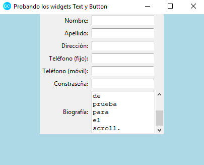

_Notas_:

- Conviene que declaremos unas longitudes adecuadas mediante los parámetros
  `width` y `height`, ya que las asignadas por defecto son ciertamente elevadas.
- El _widget_ `Text` automáticamente permite la posibilidad de _scroll_, aunque
  si deseamos que aparezca una barra de desplazamiento lateral, hemos de
  indicarlo. Para ello, se requiere la construcción de un objeto de la clase
  `Scrollbar` (que hemos de importar de la librería `tkinter`) y asociarlo al
  cuadro de texto generado. La correspondiente instrucción que se ocupa de tal
  tarea en el bloque de código anterior es:

```python
scroll_vert = Scrollbar(frame, command=bio_texto.yview)
```

- Acto seguido, mediante el método `grid()`, y teniendo cuidado con el valor
  correspondiente para el parámetro `column`, terminamos haciendo que aparezca
  en la ventana de la aplicación. Para que se adapte al tamaño del cuadro de
  texto asociado, una posible estrategia es incluir `sticky="nsew"` en la
  declaración del _scroll_.
- Por otro lado, si queremos que se posicione la barra de desplazamiento al
  nivel del texto que estamos introduciendo, incluiremos la instrucción
  `bio_texto.config(yscrollcommand=scroll_vert.set)` tras la declaración de la
  variable `scroll_vert`.

Pasemos ahora a añadir un botón a nuestra interfaz gráfica, para lo cual haremos
uso de la clase `Button`. Posicionemos uno en la raíz (`root`) de la ventana de
la aplicación:

```python
boton_envio = Button(root, text="Enviar")
boton_envio.pack()
```

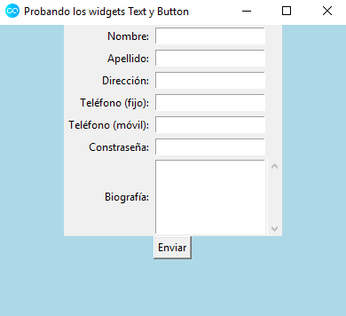

A continuación, veamos cómo añadir cierta funcionalidad al botón generado. Para
ello, incluimos en su declaración el parámetro `command=codigo_boton`,

```python
boton_envio = Button(root, text="Enviar", command=codigo_boton)
```

donde `codigo_boton` será una función que contendrá el código con las acciones
que deseemos se lleven a cabo cuando el usuario pulse sobre el botón.

Por ejemplo, aunque no sea la característica habitual de este tipo de botones,
hagamos que cuando el usuario pulse sobre el mencionado botón, se escriba
nuestro nombre automáticamente en el cuadro de texto correspondiente. Así,
tecleamos:

```python
def codigo_boton():
    mi_nombre.set("Alexis")


root = Tk()

mi_nombre = StringVar()
```

La instrucción `mi_nombre = StringVar()` únicamente le indica a _Python_ que la
variable `mi_nombre` es una cadena de caracteres. Como viene siendo habitual,
habremos de importar la correspondiente clase al comienzo del código (o,
directamente, utilizar el esquema `from ... import *`). Ahora, modificamos la
declaración del cuadro de texto asociado al nombre del usuario introduciendo el
parámetro `textvariable`:

```python
cuadro_nombre = Entry(frame, textvariable=mi_nombre)
```

_Nota técnica_: no podemos utilizar `StringVar()` antes de definir la raíz
(`root`) de la aplicación.

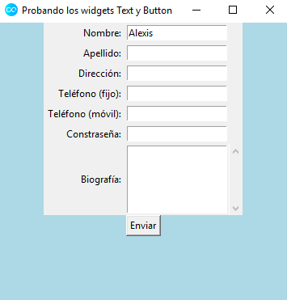

Si la función `set()` nos permite declarar el valor de un cuadro de texto, para
obtener la información que el usuario introduzca en uno, utilizaremos, en
próximas lecciones, el método `get()`.

Finalmente, comparto el código completo de esta última aplicación generada, para
tener acceso así a una visión global de la misma:

```python
from tkinter import Tk, Frame, Button, Entry, Label, Scrollbar, StringVar, Text


def codigo_boton():
    mi_nombre.set("Alexis")


root = Tk()

mi_nombre = StringVar()

root.title("Probando los widgets Text y Button")
root.resizable(width=True, height=True)
root.iconbitmap("icon.ico")
root.config(bg="lightblue")

frame = Frame(root, width=450, height=300)
frame.pack()

nombre_label = Label(frame, text="Nombre:")
nombre_label.grid(row=0, column=0, sticky="e", padx=2, pady=2)

cuadro_nombre = Entry(frame, textvariable=mi_nombre)
cuadro_nombre.grid(row=0, column=1, padx=2, pady=2)

apellido_label = Label(frame, text="Apellido:")
apellido_label.grid(row=1, column=0, sticky="e", padx=2, pady=2)

apellido_texto = Entry(frame)
apellido_texto.grid(row=1, column=1, padx=2, pady=2)

direccion_label = Label(frame, text="Dirección:")
direccion_label.grid(row=2, column=0, sticky="e", padx=2, pady=2)

direccion_texto = Entry(frame)
direccion_texto.grid(row=2, column=1, padx=2, pady=2)

tfno_label = Label(frame, text="Teléfono (fijo):")
tfno_label.grid(row=3, column=0, sticky="e", padx=2, pady=2)

tfno_texto = Entry(frame)
tfno_texto.grid(row=3, column=1, padx=2, pady=2)

movil_label = Label(frame, text="Teléfono (móvil):")
movil_label.grid(row=4, column=0, sticky="e", padx=2, pady=2)

movil_texto = Entry(frame)
movil_texto.grid(row=4, column=1, padx=2, pady=2)

pass_label = Label(frame, text="Constraseña:")
pass_label.grid(row=5, column=0, sticky="e", padx=2, pady=2)

pass_texto = Entry(frame)
pass_texto.grid(row=5, column=1, padx=2, pady=2)
pass_texto.config(show="*")

bio_label = Label(frame, text="Biografía:")
bio_label.grid(row=6, column=0, sticky="e", padx=2, pady=2)

bio_texto = Text(frame, width=15, height=5)
bio_texto.grid(row=6, column=1, padx=2, pady=2)

scroll_vert = Scrollbar(frame, command=bio_texto.yview)
scroll_vert.grid(row=6, column=2, sticky="nsew")
bio_texto.config(yscrollcommand=scroll_vert.set)

boton_envio = Button(root, text="Enviar", command=codigo_boton)
boton_envio.pack()

root.mainloop()
```

### 6. Interfaces Gráficas VI

#### 6.1. Vídeo



#### 6.2. Notas personales

A partir de esta lección, utilizando los conocimientos adquiridos a lo largo de
todo el curso, empezaremos un nuevo proyecto: la creación de una calculadora.
Comencemos elaborando su interfaz gráfica:

```python
from tkinter import Button, Entry, Frame, Tk

# Raíz
raiz = Tk()
raiz.title("Calculadora")
raiz.iconbitmap("icon.ico")

# Frame
frame = Frame(raiz)
frame.pack()

# Pantalla
pantalla = Entry(frame)
pantalla.grid(row=1, column=1, padx=10, pady=10, columnspan=4)
pantalla.config(background="black", fg="#03f943", justify="right")

# Fila 1 de botones
boton7 = Button(frame, text="7", width=3)
boton7.grid(row=2, column=1)
boton8 = Button(frame, text="8", width=3)
boton8.grid(row=2, column=2)
boton9 = Button(frame, text="9", width=3)
boton9.grid(row=2, column=3)
boton_div = Button(frame, text="/", width=3)
boton_div.grid(row=2, column=4)

# Fila 2 de botones
boton4 = Button(frame, text="4", width=3)
boton4.grid(row=3, column=1)
boton5 = Button(frame, text="5", width=3)
boton5.grid(row=3, column=2)
boton6 = Button(frame, text="6", width=3)
boton6.grid(row=3, column=3)
boton_mult = Button(frame, text="*", width=3)
boton_mult.grid(row=3, column=4)

# Fila 3 de botones
boton1 = Button(frame, text="1", width=3)
boton1.grid(row=4, column=1)
boton2 = Button(frame, text="2", width=3)
boton2.grid(row=4, column=2)
boton3 = Button(frame, text="3", width=3)
boton3.grid(row=4, column=3)
boton_rest = Button(frame, text="-", width=3)
boton_rest.grid(row=4, column=4)

# Fila 4 de botones
boton0 = Button(frame, text="0", width=3)
boton0.grid(row=5, column=1)
boton_coma = Button(frame, text=".", width=3)
boton_coma.grid(row=5, column=2)
boton_igual = Button(frame, text="=", width=3)
boton_igual.grid(row=5, column=3)
boton_suma = Button(frame, text="+", width=3)
boton_suma.grid(row=5, column=4)

raiz.mainloop()
```

_Nota_: la pantalla ha de ocupar no una columna, sino cuatro, ya que hemos
generado después filas de cuatro botones. Para ello, utilizamos el parámetro
`columnspan` en la función `grid()` correspondiente a la pantalla y le asignamos
el valor `4`.



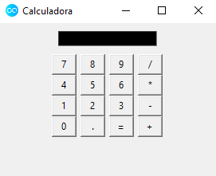

### 7. Interfaces Gráficas VII

#### 7.1. Vídeo



#### 7.2. Notas personales

Una vez elaborada la interfaz gráfica de la calculadora, en esta lección
abordaremos cómo programar parte de la funcionalidad de la misma. Para empezar,
nuestro objetivo será conseguir que al pulsar los diferentes botones numéricos
aparezcan sus valores asociados en la pantalla.

Empecemos creando una variable para almacenar una cadena de texto y asociémosla
a la pantalla:

```python
numero_pantalla = StringVar()

pantalla = Entry(frame, textvariable=numero_pantalla)
```

A continuación, creemos una función que, por ejemplo, escriba el número `4` en
pantalla:

```python
# Pulsaciones teclado
def numero_pulsado():
    numero_pantalla.set("4")
```

Ahora, asociémosla al botón correspondiente:

```python
boton4 = Button(frame, text="4", width=3, command=numero_pulsado)
```

Ahora, al pulsar en el botón del número cuatro, aparece un `4` en la pantalla.
Vemos que si pulsamos en varias ocasiones, no se añaden más cuatros, que sería
el comportamiento deseable. Modifiquemos la función `numero_pulsado()` para
conseguir tal efecto. Para ello, obtendremos la información actual de la
pantalla y le agregaremos el número `4` después:

```python
# Pulsaciones teclado
def numero_pulsado():
    numero_pantalla.set(numero_pantalla.get() + "4")
```

Para generalizar, necesitaremos el uso de funciones _lambda_ o _anónimas_ en la
declaración de los botones. De no utilizarlas, tal y como transcurre el flujo
del programa, al llegar a la línea de la declaración de `boton4`, se produciría
directamente la llamada de la función `numero_pulsado("4")`, mostrando (sin que
el usuario pulse sobre nada) un `4` en la pantalla al abrir la calculadura y,
además, deshabilitando la funcionalidad del botón, puesto que al seguir pulsando
sobre él no añade más cuatros.

```python
def numero_pulsado(num):
    numero_pantalla.set(numero_pantalla.get() + num)

boton4 = Button(frame, text="4", width=3, command=lambda: numero_pulsado("4"))
```

Para finalizar, incluyo el código completo de la aplicación elaborada hasta este
instante, para obtener así una visión global de la calculadora:

```python
from tkinter import Button, Entry, Frame, StringVar, Tk

# Raíz
raiz = Tk()
raiz.title("Calculadora")
raiz.iconbitmap("icon.ico")

# Frame
frame = Frame(raiz)
frame.pack()

# Variables
numero_pantalla = StringVar()

# Pantalla
pantalla = Entry(frame, textvariable=numero_pantalla)
pantalla.grid(row=1, column=1, padx=10, pady=10, columnspan=4)
pantalla.config(background="black", fg="#03f943", justify="right")


# Pulsaciones teclado
def numero_pulsado(num):
    numero_pantalla.set(numero_pantalla.get() + num)


# Fila 1 de botones
boton7 = Button(frame, text="7", width=3, command=lambda: numero_pulsado("7"))
boton7.grid(row=2, column=1)
boton8 = Button(frame, text="8", width=3, command=lambda: numero_pulsado("8"))
boton8.grid(row=2, column=2)
boton9 = Button(frame, text="9", width=3, command=lambda: numero_pulsado("9"))
boton9.grid(row=2, column=3)
boton_div = Button(frame, text="/", width=3)
boton_div.grid(row=2, column=4)

# Fila 2 de botones
boton4 = Button(frame, text="4", width=3, command=lambda: numero_pulsado("4"))
boton4.grid(row=3, column=1)
boton5 = Button(frame, text="5", width=3, command=lambda: numero_pulsado("5"))
boton5.grid(row=3, column=2)
boton6 = Button(frame, text="6", width=3, command=lambda: numero_pulsado("6"))
boton6.grid(row=3, column=3)
boton_mult = Button(frame, text="*", width=3)
boton_mult.grid(row=3, column=4)

# Fila 3 de botones
boton1 = Button(frame, text="1", width=3, command=lambda: numero_pulsado("1"))
boton1.grid(row=4, column=1)
boton2 = Button(frame, text="2", width=3, command=lambda: numero_pulsado("2"))
boton2.grid(row=4, column=2)
boton3 = Button(frame, text="3", width=3, command=lambda: numero_pulsado("3"))
boton3.grid(row=4, column=3)
boton_rest = Button(frame, text="-", width=3)
boton_rest.grid(row=4, column=4)

# Fila 4 de botones
boton0 = Button(frame, text="0", width=3, command=lambda: numero_pulsado("0"))
boton0.grid(row=5, column=1)
boton_coma = Button(frame,
                    text=".",
                    width=3,
                    command=lambda: numero_pulsado("."))
boton_coma.grid(row=5, column=2)
boton_igual = Button(frame, text="=", width=3)
boton_igual.grid(row=5, column=3)
boton_suma = Button(frame, text="+", width=3)
boton_suma.grid(row=5, column=4)

raiz.mainloop()
```

### 8. Interfaces Gráficas VIII

#### 8.1. Vídeo



#### 8.2. Notas personales

En esta lección, nuestro objetivo será conseguir que la calculadora que estamos
generando sea capaz de sumar valores numéricos enteros.

Empecemos declarando una variable global, que será accesible desde todos las
funciones del programa, denominada `operacion` y que almacenará la operación
aritmética que desea el usuario llevar a cabo. Además, la utilizaremos para
conseguir que la pantalla vuelva a su estado inicial a través del uso de bloques
condicionales.

```python
operación = ""
```

Esta variable cambiará de valor a medida que pulsemos los botones de operaciones
aritméticas. Por ejemplo, para la suma, definimos la función:

```python
# Función suma
def suma():
    global operacion
    operacion = "suma"
```

A continuación, modificamos el código de `boton_suma` como sigue:

```python
boton_suma = Button(frame, text="+", width=3, command=lambda: suma())
```

Acto seguido, hemos de conseguir que, cuando se pulse dicho botón, la pantalla
se borre y permita el almacenamiento de un nuevo número. Modifiquemos la función
`numero_pulsado()`:

```python
def numero_pulsado(num):
    global operacion
    if operacion != "":
        numero_pantalla.set(num)
        operacion = ""
    else:
        numero_pantalla.set(numero_pantalla.get() + num)
```

Si pulsamos sobre el botón de sumar, la condición `operacion != ""` sería
cierta, por lo que entraríamos en esa parte de la estructura condicional. En su
interior, apreciamos que no concatenamos el número con nada más y volvemos a
declarar el valor de la variable `operacion` como una cadena vacía, para
permitir así la correcta introducción de un nuevo número.

Ahora necesitamos una variable global, que denominaremos `resultado`, que vaya
almacenando los valores introducidos:

```python
resultado = 0
```

La siguiente tarea consiste en actualizar la función `suma()`:

```python
# Función suma
def suma(num):
    global operacion, resultado
    operacion = "suma"
    resultado += int(num)
    numero_pantalla.set(resultado)
```

donde `num` representa el número que aparece en la pantalla de la calculadora al
pulsar el botón de sumar. Como estamos trabajando con cuadros de texto, _Python_
almacena los textos, lógicamente como su nombre indica, como cadenas de
caracteres, de ahí la necesidad de utilizar la función `int()`. Una vez
realizada la operación aritmética, mostramos su resultado en la pantalla con
`numero_pantalla.set(resultado)`.

El nuevo parámetro de la función `suma()` nos obliga a modificar el código de
`boton_suma`:

```python
boton_suma = Button(frame,
                    text="+",
                    width=3,
                    command=lambda: suma(numero_pantalla.get()))
```

A continuación, programemos el comportamiento del botón del símbolo igual.

```python
# Función el_resultado (para el botón igual)
def el_resultado():
    global resultado
    numero_pantalla.set(resultado + int(numero_pantalla.get()))
    resultado = 0
```

Es decir, al resultado acumulado hemos de sumarle el número que figure en
pantalla antes de pulsar el botón del símbolo igual. Tras ello, reseteamos la
variable `resultado`.

Procedamos ahora a modificar el código el mencionado botón:

```python
boton_igual = Button(frame, text="=", width=3, command=lambda: el_resultado())
```

Finalmente, como viene siendo habitual, comparto el código completo de la
aplicación para que podamos tener una visión global de la calculadora:

```python
from tkinter import Button, Entry, Frame, StringVar, Tk

# Raíz
raiz = Tk()
raiz.title("Calculadora")
raiz.iconbitmap("icon.ico")

# Frame
frame = Frame(raiz)
frame.pack()

# Variables
numero_pantalla = StringVar()
operacion = ""
resultado = 0

# Pantalla
pantalla = Entry(frame, textvariable=numero_pantalla)
pantalla.grid(row=1, column=1, padx=10, pady=10, columnspan=4)
pantalla.config(background="black", fg="#03f943", justify="right")


# Pulsaciones teclado
def numero_pulsado(num):
    global operacion
    if operacion != "":
        numero_pantalla.set(num)
        operacion = ""
    else:
        numero_pantalla.set(numero_pantalla.get() + num)


# Función suma
def suma(num):
    global operacion, resultado
    operacion = "suma"
    resultado += int(num)
    numero_pantalla.set(resultado)


# Función el_resultado (para el botón igual)
def el_resultado():
    global resultado
    numero_pantalla.set(resultado + int(numero_pantalla.get()))
    resultado = 0


# Fila 1 de botones
boton7 = Button(frame, text="7", width=3, command=lambda: numero_pulsado("7"))
boton7.grid(row=2, column=1)
boton8 = Button(frame, text="8", width=3, command=lambda: numero_pulsado("8"))
boton8.grid(row=2, column=2)
boton9 = Button(frame, text="9", width=3, command=lambda: numero_pulsado("9"))
boton9.grid(row=2, column=3)
boton_div = Button(frame, text="/", width=3)
boton_div.grid(row=2, column=4)

# Fila 2 de botones
boton4 = Button(frame, text="4", width=3, command=lambda: numero_pulsado("4"))
boton4.grid(row=3, column=1)
boton5 = Button(frame, text="5", width=3, command=lambda: numero_pulsado("5"))
boton5.grid(row=3, column=2)
boton6 = Button(frame, text="6", width=3, command=lambda: numero_pulsado("6"))
boton6.grid(row=3, column=3)
boton_mult = Button(frame, text="*", width=3)
boton_mult.grid(row=3, column=4)

# Fila 3 de botones
boton1 = Button(frame, text="1", width=3, command=lambda: numero_pulsado("1"))
boton1.grid(row=4, column=1)
boton2 = Button(frame, text="2", width=3, command=lambda: numero_pulsado("2"))
boton2.grid(row=4, column=2)
boton3 = Button(frame, text="3", width=3, command=lambda: numero_pulsado("3"))
boton3.grid(row=4, column=3)
boton_rest = Button(frame, text="-", width=3)
boton_rest.grid(row=4, column=4)

# Fila 4 de botones
boton0 = Button(frame, text="0", width=3, command=lambda: numero_pulsado("0"))
boton0.grid(row=5, column=1)
boton_coma = Button(frame,
                    text=".",
                    width=3,
                    command=lambda: numero_pulsado("."))
boton_coma.grid(row=5, column=2)
boton_igual = Button(frame, text="=", width=3, command=lambda: el_resultado())
boton_igual.grid(row=5, column=3)
boton_suma = Button(frame,
                    text="+",
                    width=3,
                    command=lambda: suma(numero_pantalla.get()))
boton_suma.grid(row=5, column=4)

raiz.mainloop()
```

### 9. Interfaces Gráficas IX

#### 9.1. Vídeo



#### 9.2. Notas personales

Partamos, en esta lección, del siguiente código fuente, que incluye, además de
la función para sumar, las correspondientes a las operaciones resta,
multiplicación y división:

```python
from tkinter import Button, Entry, Frame, StringVar, Tk

# Raíz
raiz = Tk()
raiz.title("Calculadora")
raiz.iconbitmap("icon.ico")

# Frame
frame = Frame(raiz)
frame.pack()

# Variables
numero_pantalla = StringVar()
operacion = ""
resultado = 0
reset_pantalla = False

# Pantalla
pantalla = Entry(frame, textvariable=numero_pantalla)
pantalla.grid(row=1, column=1, padx=10, pady=10, columnspan=4)
pantalla.config(background="black", fg="#03f943", justify="right")


# Pulsaciones teclado
def numero_pulsado(num):
    global operacion, reset_pantalla
    if reset_pantalla:
        numero_pantalla.set(num)
        reset_pantalla = False
    else:
        numero_pantalla.set(numero_pantalla.get() + num)


# Función suma
def suma(num):
    global operacion, reset_pantalla, resultado
    operacion = "suma"
    resultado += int(num)
    reset_pantalla = True
    numero_pantalla.set(resultado)


# Función resta
num1 = 0
contador_resta = 0


def resta(num):
    global contador_resta, num1, operacion, reset_pantalla, resultado
    if contador_resta == 0:
        num1 = int(num)
        resultado = num1
    else:
        if contador_resta == 1:
            resultado = num1 - int(num)
        else:
            resultado = int(resultado) - int(num)
        numero_pantalla.set(resultado)
        resultado = numero_pantalla.get()
    contador_resta = contador_resta + 1
    operacion = "resta"
    reset_pantalla = True


# Función multiplicación
contador_multi = 0


def multiplica(num):
    global contador_multi, num1, operacion, reset_pantalla, resultado
    if contador_multi == 0:
        num1 = int(num)
        resultado = num1
    else:
        if contador_multi == 1:
            resultado = num1 * int(num)
        else:
            resultado = int(resultado) * int(num)
        numero_pantalla.set(resultado)
        resultado = numero_pantalla.get()
    contador_multi = contador_multi + 1
    operacion = "multiplicacion"
    reset_pantalla = True


# Función división
contador_divi = 0


def divide(num):
    global contador_divi, num1, operacion, reset_pantalla, resultado
    if contador_divi == 0:
        num1 = float(num)
        resultado = num1
    else:
        if contador_resta == 1:
            resultado = num1 / float(num)
        else:
            resultado = float(resultado) / float(num)
        numero_pantalla.set(resultado)
        resultado = numero_pantalla.get()
    contador_divi = contador_divi + 1
    operacion = "division"
    reset_pantalla = True


# Función el_resultado (para el botón igual)
def el_resultado():
    global contador_divi, contador_multi, contador_resta, operacion, resultado
    if operacion == "suma":
        numero_pantalla.set(resultado + int(numero_pantalla.get()))
        resultado = 0
    elif operacion == "resta":
        numero_pantalla.set(int(resultado) - int(numero_pantalla.get()))
        resultado = 0
        contador_resta = 0
    elif operacion == "multiplicacion":
        numero_pantalla.set(int(resultado) * int(numero_pantalla.get()))
        resultado = 0
        contador_multi = 0
    elif operacion == "division":
        numero_pantalla.set(int(resultado) / int(numero_pantalla.get()))
        resultado = 0
        contador_divi = 0


# Fila 1 de botones
boton7 = Button(frame, text="7", width=3, command=lambda: numero_pulsado("7"))
boton7.grid(row=2, column=1)
boton8 = Button(frame, text="8", width=3, command=lambda: numero_pulsado("8"))
boton8.grid(row=2, column=2)
boton9 = Button(frame, text="9", width=3, command=lambda: numero_pulsado("9"))
boton9.grid(row=2, column=3)
boton_div = Button(frame,
                   text="/",
                   width=3,
                   command=lambda: divide(numero_pantalla.get()))
boton_div.grid(row=2, column=4)

# Fila 2 de botones
boton4 = Button(frame, text="4", width=3, command=lambda: numero_pulsado("4"))
boton4.grid(row=3, column=1)
boton5 = Button(frame, text="5", width=3, command=lambda: numero_pulsado("5"))
boton5.grid(row=3, column=2)
boton6 = Button(frame, text="6", width=3, command=lambda: numero_pulsado("6"))
boton6.grid(row=3, column=3)
boton_mult = Button(frame,
                    text="*",
                    width=3,
                    command=lambda: multiplica(numero_pantalla.get()))
boton_mult.grid(row=3, column=4)

# Fila 3 de botones
boton1 = Button(frame, text="1", width=3, command=lambda: numero_pulsado("1"))
boton1.grid(row=4, column=1)
boton2 = Button(frame, text="2", width=3, command=lambda: numero_pulsado("2"))
boton2.grid(row=4, column=2)
boton3 = Button(frame, text="3", width=3, command=lambda: numero_pulsado("3"))
boton3.grid(row=4, column=3)
boton_rest = Button(frame,
                    text="-",
                    width=3,
                    command=lambda: resta(numero_pantalla.get()))
boton_rest.grid(row=4, column=4)

# Fila 4 de botones
boton0 = Button(frame, text="0", width=3, command=lambda: numero_pulsado("0"))
boton0.grid(row=5, column=1)
boton_coma = Button(frame,
                    text=".",
                    width=3,
                    command=lambda: numero_pulsado("."))
boton_coma.grid(row=5, column=2)
boton_igual = Button(frame, text="=", width=3, command=lambda: el_resultado())
boton_igual.grid(row=5, column=3)
boton_suma = Button(frame,
                    text="+",
                    width=3,
                    command=lambda: suma(numero_pantalla.get()))
boton_suma.grid(row=5, column=4)

raiz.mainloop()
```

A continuación, veremos cómo trabajar con botones de radio, es decir, con la
clase `Radiobutton`.

```python
from tkinter import Radiobutton, Tk

raiz = Tk()
raiz.title("Botones de radio")
raiz.iconbitmap("icon.ico")

Radiobutton(raiz, text="Femenino").pack()
Radiobutton(raiz, text="Masculino").pack()

raiz.mainloop()
```

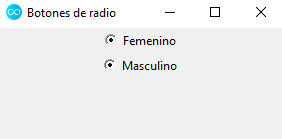

A primera vista, observamos dos inconvenientes:

- aparecen ambas opciones seleccionadas al abrir la aplicación y
- por mucho que pulse sobre ellas, la selección no se modifica.

Para abordar esta situación, comenzamos creando una variable global, `opcion`,
perteneciente a la clase `IntVar` y se la asignamos a ambos botones a través del
parámetro `variable`; junto con un valor para cada uno de ellos, utilizando el
parámetro `value`.

```python
from tkinter import IntVar, Radiobutton, Tk

raiz = Tk()
raiz.title("Botones de radio")
raiz.iconbitmap("icon.ico")

opcion = IntVar()

Radiobutton(raiz, text="Femenino", variable=opcion, value=1).pack()
Radiobutton(raiz, text="Masculino", variable=opcion, value=2).pack()

raiz.mainloop()
```

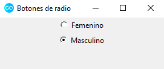

_Nota técnica_: si asignamos `value=0` a alguno de los botones, aparecerá
seleccionado por defecto cuando abramos la aplicación. Esta característica puede
resultar de cierta utilidad en algunos contextos.

Ahora bien, ¿cómo rescatamos el valor que ha seleccionado el usuario? Al igual
que sucedía en el caso de la calculadora, recurriremos al uso de funciones en
esta ocasión.

Así, generemos una, denominada `imprimir`, que imprima en la consola de _Python_
el valor del botón seleccionado:

```python
from tkinter import IntVar, Label, Radiobutton, Tk

raiz = Tk()
raiz.title("Botones de radio")
raiz.iconbitmap("icon.ico")

opcion = IntVar()


def imprimir():
    print(opcion.get())


Label(raiz, text="Género:").pack()
Radiobutton(raiz, text="Femenino", variable=opcion, value=1,
            command=imprimir).pack()
Radiobutton(raiz, text="Masculino", variable=opcion, value=2,
            command=imprimir).pack()

raiz.mainloop()
```

Modifiquemos el código para ver dichos valores en la propia interfaz:

```python
from tkinter import IntVar, Label, Radiobutton, Tk

raiz = Tk()
raiz.title("Botones de radio")
raiz.iconbitmap("icon.ico")

opcion = IntVar()


def imprimir():
    if opcion.get() == 1:
        etiqueta.config(text="Has elegido género femenino.")
    else:
        etiqueta.config(text="Has elegido género masculino.")


Label(raiz, text="Género:").pack()
Radiobutton(raiz, text="Femenino", variable=opcion, value=1,
            command=imprimir).pack()
Radiobutton(raiz, text="Masculino", variable=opcion, value=2,
            command=imprimir).pack()

etiqueta = Label(raiz)
etiqueta.pack()

raiz.mainloop()
```

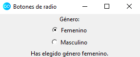

Incorporar un botón adicional que contemple otros géneros es sencillo:

```python
from tkinter import IntVar, Label, Radiobutton, Tk

raiz = Tk()
raiz.title("Botones de radio")
raiz.iconbitmap("icon.ico")

opcion = IntVar()


def imprimir():
    if opcion.get() == 1:
        etiqueta.config(text="Has elegido género femenino.")
    elif opcion.get() == 2:
        etiqueta.config(text="Has elegido género masculino.")
    else:
        etiqueta.config(text="Has elegido otras opciones para género.")


Label(raiz, text="Género:").pack()
Radiobutton(raiz, text="Femenino", variable=opcion, value=1,
            command=imprimir).pack()
Radiobutton(raiz, text="Masculino", variable=opcion, value=2,
            command=imprimir).pack()
Radiobutton(raiz, text="Otras opciones", variable=opcion, value=3,
            command=imprimir).pack()

etiqueta = Label(raiz)
etiqueta.pack()

raiz.mainloop()
```

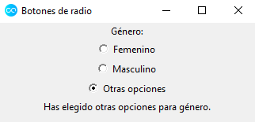

### 10. Interfaces Gráficas X

#### 10.1. Vídeo



#### 10.2. Notas personales

En esta lección, introduciremos el funcionamiento de la clase `Checkbutton`, que
se encarga de gestionar los clásicos _botones de selección_ (también denominados
_casillas de verificación_). Estos nos permiten la posibilidad de realizar una
selección múltiple sobre distintas opciones ofrecidas.

Acto seguido, veamos un sencillo ejemplo de aplicación de la mencionada clase,
donde el usuario ha de escoger qué tipo de destinos prefiere para sus
vacaciones.

```python
from tkinter import Checkbutton, Frame, IntVar, Label, PhotoImage, Tk

raiz = Tk()
raiz.title("Casillas de verificación")
raiz.iconbitmap("icon.ico")

playa = IntVar()
montana = IntVar()
turismo_rural = IntVar()


def opciones_viaje():
    opcion_escogida = ""
    if playa.get() == 1:
        opcion_escogida += " playa"
    if montana.get() == 1:
        opcion_escogida += " montaña"
    if turismo_rural.get() == 1:
        opcion_escogida += " turismo rural"
    texto_final.config(text=opcion_escogida)


foto = PhotoImage(file="helicoptero.png")
Label(raiz, image=foto).pack()

frame = Frame(raiz)
frame.pack()

Label(frame, text="Escoge destinos:", width=50).pack()

Checkbutton(frame,
            text="Playa",
            variable=playa,
            onvalue=1,
            offvalue=0,
            command=opciones_viaje).pack()
Checkbutton(frame,
            text="Montaña",
            variable=montana,
            onvalue=1,
            offvalue=0,
            command=opciones_viaje).pack()
Checkbutton(frame,
            text="Turismo rural",
            variable=turismo_rural,
            onvalue=1,
            offvalue=0,
            command=opciones_viaje).pack()

texto_final = Label(frame)
texto_final.pack()

raiz.mainloop()
```

Para empezar, el siguiente bloque de código

```python
foto = PhotoImage(file="helicoptero.png")
Label(raiz, image=foto).pack()
```

nos permite introducir, como cabecera de nuestra aplicación, la imagen de un
helicóptero (disponible en
[este enlace](https://www.freepng.es/png-ct7rpy/download.html)).

A continuación, las líneas de código asociadas a la primera casilla de
verificación son

```python
Checkbutton(frame,
            text="Playa",
            variable=playa,
            onvalue=1,
            offvalue=0,
            command=opciones_viaje).pack()
```

Observamos que dicha casilla está ubicada en el _frame_ `frame` y muestra como
texto, en la ventana de la aplicación, la palabra `Playa`. Para posibilitar la
interacción con ella, almacenamos su valor en la variable `playa`, siendo este
`1` cuando esté seleccionada y `0` en otro caso. Finalmente, su comportamiento
se gestiona a través de la función `opciones_viaje()`, tal y como figura en el
valor del parámetro `command`.

Por lo que respecta a la variable `playa`, así como al resto, las declaramos
utilizando la clase `IntVar`, puesto que nuestra intención es almacenar en ellas
valores enteros:

```python
playa = IntVar()
montana = IntVar()
turismo_rural = IntVar()
```

Por otro lado, mostraremos las opciones seleccionadas por el usuario empleando
una etiqueta para ello, de ahí que figure el siguiente bloque de código al final
del programa:

```python
texto_final = Label(frame)
texto_final.pack()
```

Finalmente, la función que gestiona el comportamiento de las casillas de
verificación simplemente se ocupa de establecer el texto de la variable
`texto_final` según una serie de bloques condicionales:

```python
def opciones_viaje():
    opcion_escogida = ""
    if playa.get() == 1:
        opcion_escogida += " playa"
    if montana.get() == 1:
        opcion_escogida += " montaña"
    if turismo_rural.get() == 1:
        opcion_escogida += " turismo rural"
    texto_final.config(text=opcion_escogida)
```

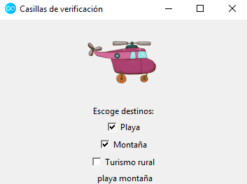

### 11. Interfaces Gráficas XI

#### 11.1. Vídeo



#### 11.2. Notas personales

En esta lección, abordaremos el estudio del _widget_ `Menu`, que nos permitirá
la posibilidad de crear barras de menús.

Comencemos utilizando el siguiente esqueleto de aplicación:

```python
from tkinter import Tk

raiz = Tk()
raiz.title("Menús")
raiz.iconbitmap("icon.ico")

raiz.mainloop()
```

A continuación, generamos una variable, `barra_menu`, que será la encargada de
almacenar el menú:

```python
barra_menu = Menu(raiz)
```

y configuramos el valor del parámetro `menu` de la _raíz_ para que figure en
nuestra aplicación:

```python
raiz.config(menu=barra_menu)
```

Acto seguido, establecemos los elementos que conformarán nuestro menú. Por
ejemplo, para crear uno denominado _Archivo_, generamos la variable
`archivo_menu`, indicándole que pertenece a la barra de menús `barra_menu`.

```python
archivo_menu = Menu(barra_menu)
```

No obstante, si ejecutamos el código, todavía no aparece barra de menús alguna.
Añadamos el texto correspondiente a cada elemento. Así,

```python
barra_menu.add_cascade(label="Archivo", menu=archivo_menu)
```

Ahora, ya únicamente nos resta la tarea de añadir elementos de submenú. Para
ello, tras la línea de declaración del elemento `archivo_menu`, tecleamos:

```python
archivo_menu.add_command(label="Nuevo")
archivo_menu.add_command(label="Abrir")
archivo_menu.add_command(label="Guardar")
archivo_menu.add_command(label="Guardar como...")
archivo_menu.add_command(label="Cerrar")
archivo_menu.add_command(label="Salir")
```

Aparece una barra separadora, que identificamos por los símbolos `- - - -`, al
pulsar sobre cualquier elemento de la barra de menús. Para suprimirla,
modificamos como sigue la línea de declaración de la variable `archivo_menu`:

```python
archivo_menu = Menu(barra_menu, tearoff=0)
```

No obstante, aunque la mencionada barra separada no nos interesaba, sí que
podemos desear diferenciar, de alguna manera, los diversos elementos de un
submenú, para que así queden agrupados por cierto criterio. Con tal objetivo,
donde nos convenga, introducimos la instrucción

```python
archivo_menu.add_separator()
```

Para acabar, comparto el código completo de la aplicación, para obtener así una
visión global del funcionamiento de la clase `Menu`.

```python
from tkinter import Menu, Tk

raiz = Tk()
raiz.title("Menús")
raiz.iconbitmap("icon.ico")

barra_menu = Menu(raiz)

raiz.config(menu=barra_menu, width=300, height=300)

archivo_menu = Menu(barra_menu, tearoff=0)
archivo_menu.add_command(label="Nuevo")
archivo_menu.add_command(label="Abrir")
archivo_menu.add_separator()
archivo_menu.add_command(label="Guardar")
archivo_menu.add_command(label="Guardar como...")
archivo_menu.add_separator()
archivo_menu.add_command(label="Cerrar")
archivo_menu.add_command(label="Salir")

edicion_menu = Menu(barra_menu, tearoff=0)
edicion_menu.add_command(label="Copiar")
edicion_menu.add_command(label="Cortar")
edicion_menu.add_command(label="Pegar")

herramientas_menu = Menu(barra_menu, tearoff=0)

ayuda_menu = Menu(barra_menu, tearoff=0)
ayuda_menu.add_command(label="Licencia")
ayuda_menu.add_separator()
ayuda_menu.add_command(label="Acerca de...")

barra_menu.add_cascade(label="Archivo", menu=archivo_menu)
barra_menu.add_cascade(label="Edición", menu=edicion_menu)
barra_menu.add_cascade(label="Herramientas", menu=herramientas_menu)
barra_menu.add_cascade(label="Ayuda", menu=ayuda_menu)

raiz.mainloop()
```

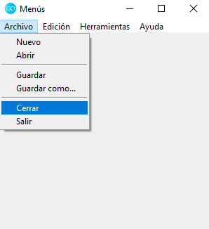

### 12. Interfaces Gráficas XII

#### 12.1. Vídeo



#### 12.2. Notas personales

En esta lección, estudiaremos cómo construir ventanas emergentes, que son
ventanas modales para informar, avisar o permitir realizar ciertas tareas al
usuario.

Para comenzar, recuperemos el código fuente generado en la lección anterior:

```python
from tkinter import Menu, Tk

raiz = Tk()
raiz.title("Menús")
raiz.iconbitmap("icon.ico")

barra_menu = Menu(raiz)

raiz.config(menu=barra_menu, width=300, height=300)

archivo_menu = Menu(barra_menu, tearoff=0)
archivo_menu.add_command(label="Nuevo")
archivo_menu.add_command(label="Abrir")
archivo_menu.add_separator()
archivo_menu.add_command(label="Guardar")
archivo_menu.add_command(label="Guardar como...")
archivo_menu.add_separator()
archivo_menu.add_command(label="Cerrar")
archivo_menu.add_command(label="Salir")

edicion_menu = Menu(barra_menu, tearoff=0)
edicion_menu.add_command(label="Copiar")
edicion_menu.add_command(label="Cortar")
edicion_menu.add_command(label="Pegar")

herramientas_menu = Menu(barra_menu, tearoff=0)

ayuda_menu = Menu(barra_menu, tearoff=0)
ayuda_menu.add_command(label="Licencia")
ayuda_menu.add_separator()
ayuda_menu.add_command(label="Acerca de...")

barra_menu.add_cascade(label="Archivo", menu=archivo_menu)
barra_menu.add_cascade(label="Edición", menu=edicion_menu)
barra_menu.add_cascade(label="Herramientas", menu=herramientas_menu)
barra_menu.add_cascade(label="Ayuda", menu=ayuda_menu)

raiz.mainloop()
```

A continuación, nuestro objetivo será construir una ventana emergente que
aparezca cuando el usuario pulse sobre la opción _Acerca de..._, ubicada en el
menú _Ayuda_. Para ello, empecemos creando una función que será la responsable
de generar la mencionada ventana emergente:

```python
def info_adicional():
    messagebox.showinfo(title="Acerca de...",
                        message="Aplicación creada por Alexis Sáez.")
```

_Notas_:

- Hemos de importar el módulo `messagebox` al principio de nuestro código.
- El parámetro `title` gestiona el texto que aparecerá en la barra que figura en
  la parte superior de la ventana emergente.
- El parámetro `text` declara el texto que se ubicará en el cuerpo de la ventana
  emergente.

Acto seguido, modificamos la declaración del submenú _Acerca de..._ como sigue:

```python
ayuda_menu.add_command(label="Acerca de...", command=info_adicional)
```

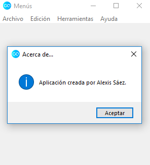

Estas ventanas emergentes admiten enormes posibilidades de configuración y
podemos adaptarlas según nuestra intención sea informar al usuario de algún
detalle concreto (como el ejemplo que se muestra en la imagen que figura
arriba), avisarle de algún error, etc. Los símbolos y la disposición de los
diferentes botones asociados variarían en función de nuestro objetivo.

Por ejemplo, generemos una ventana emergente que nos avise del estado de la
licencia de nuestra aplicación. Para ello, creamos la siguiente función:

```python
def aviso_licencia():
    messagebox.showwarning(title="Licencia",
                           message="Producto bajo licencia GNU.")
```

y modificamos la correspondiente opción del menú _Ayuda_:

```python
ayuda_menu.add_command(label="Licencia", command=aviso_licencia)
```

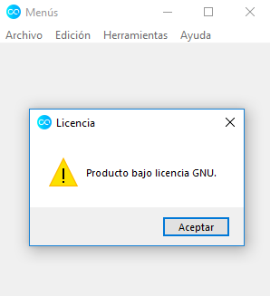

Acto seguido, veamos un nuevo tipo de ventana emergente, que asociaremos al
submenú _Salir_ y que nos pedirá confirmación antes de proceder a cerrar la
aplicación. Con tal objetivo en mente, empecemos construyendo la función:

```python
def salir_aplicacion():
    messagebox.askquestion(title="Salir",
                           message="¿Desear salir de la aplicación?")
```

para luego modificar la opción del menú _Archivo_ asociada:

```python
archivo_menu.add_command(label="Salir", command=salir_aplicacion)
```

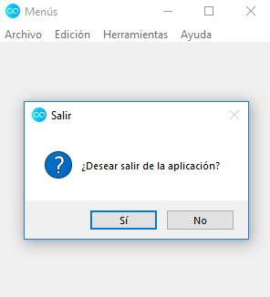

Ahora, si pulsamos sobre el botón _No_, volvemos a la aplicación, como cabría
esperar. No obstante, al pulsar sobre el botón _Sí_ debería salir de la
aplicación y no sucede tal acción, puesto que hemos de programar todavía dicho
comportamiento.

La función `askquestion()` devuelve una cadena de texto en función del botón
pulsado, `"yes"` o `"no"`, por lo que basta modificar la función
`salir_aplicacion()` como sigue:

```python
def salir_aplicacion():
    respuesta = messagebox.askquestion(
        title="Salir", message="¿Desear salir de la aplicación?")
    if respuesta == "yes":
        raiz.destroy()
```

La función `destroy()` posee un nombre lo suficientemente explicativo para que
intuyamos cómo afecta a la _raíz_ de la aplicación.

_Nota_: con la función `askokcancel()` tenemos una variante de la anterior
ventana emergente, cuyos botones son del tipo _Aceptar_ y _Cancelar_.

A continuación, veamos una ventana emergente de tipo ''reintentar'', asociada a
la opción _Cerrar_ del menú _Archivo_. Para ello, construimos la siguiente
función:

```python
def cerrar_documento():
    messagebox.askretrycancel(
        title="Reintentar",
        message="No es posible cerrar. Documento bloqueado.")
```

y modificamos el correspondiente elemento del menú _Archivo_:

```python
archivo_menu.add_command(label="Cerrar", command=cerrar_documento)
```

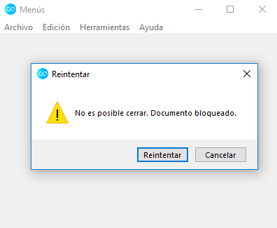

Finalmente, como viene siendo habitual en este subapartado del curso dedicado a
las interfaces gráficas, comparto el código completo de la aplicación generada
para así ofrecer una visión global de la misma.

```python
from tkinter import Menu, messagebox, Tk


def info_adicional():
    messagebox.showinfo(title="Acerca de...",
                        message="Aplicación creada por Alexis Sáez.")


def aviso_licencia():
    messagebox.showwarning(title="Licencia",
                           message="Producto bajo licencia GNU.")


def salir_aplicacion():
    respuesta = messagebox.askquestion(
        title="Salir", message="¿Desear salir de la aplicación?")
    if respuesta == "yes":
        raiz.destroy()


def cerrar_documento():
    messagebox.askretrycancel(
        title="Reintentar",
        message="No es posible cerrar. Documento bloqueado.")


raiz = Tk()
raiz.title("Menús")
raiz.iconbitmap("icon.ico")

barra_menu = Menu(raiz)

raiz.config(menu=barra_menu, width=300, height=300)

archivo_menu = Menu(barra_menu, tearoff=0)
archivo_menu.add_command(label="Nuevo")
archivo_menu.add_command(label="Abrir")
archivo_menu.add_separator()
archivo_menu.add_command(label="Guardar")
archivo_menu.add_command(label="Guardar como...")
archivo_menu.add_separator()
archivo_menu.add_command(label="Cerrar", command=cerrar_documento)
archivo_menu.add_command(label="Salir", command=salir_aplicacion)

edicion_menu = Menu(barra_menu, tearoff=0)
edicion_menu.add_command(label="Copiar")
edicion_menu.add_command(label="Cortar")
edicion_menu.add_command(label="Pegar")

herramientas_menu = Menu(barra_menu, tearoff=0)

ayuda_menu = Menu(barra_menu, tearoff=0)
ayuda_menu.add_command(label="Licencia", command=aviso_licencia)
ayuda_menu.add_separator()
ayuda_menu.add_command(label="Acerca de...", command=info_adicional)

barra_menu.add_cascade(label="Archivo", menu=archivo_menu)
barra_menu.add_cascade(label="Edición", menu=edicion_menu)
barra_menu.add_cascade(label="Herramientas", menu=herramientas_menu)
barra_menu.add_cascade(label="Ayuda", menu=ayuda_menu)

raiz.mainloop()
```

### 13. Interfaces Gráficas XIII

#### 13.1. Vídeo



#### 13.2. Notas personales

En esta lección, construiremos la típica ventana emergente que nos permite abrir
un archivo en una aplicación. Para empezar, recuperemos el código fuente
generado en las últimas lecciones:

```python
from tkinter import Menu, messagebox, Tk


def info_adicional():
    messagebox.showinfo(title="Acerca de...",
                        message="Aplicación creada por Alexis Sáez.")


def aviso_licencia():
    messagebox.showwarning(title="Licencia",
                           message="Producto bajo licencia GNU.")


def salir_aplicacion():
    respuesta = messagebox.askquestion(
        title="Salir", message="¿Desear salir de la aplicación?")
    if respuesta == "yes":
        raiz.destroy()


def cerrar_documento():
    messagebox.askretrycancel(
        title="Reintentar",
        message="No es posible cerrar. Documento bloqueado.")


raiz = Tk()
raiz.title("Menús")
raiz.iconbitmap("icon.ico")

barra_menu = Menu(raiz)

raiz.config(menu=barra_menu, width=300, height=300)

archivo_menu = Menu(barra_menu, tearoff=0)
archivo_menu.add_command(label="Nuevo")
archivo_menu.add_command(label="Abrir")
archivo_menu.add_separator()
archivo_menu.add_command(label="Guardar")
archivo_menu.add_command(label="Guardar como...")
archivo_menu.add_separator()
archivo_menu.add_command(label="Cerrar", command=cerrar_documento)
archivo_menu.add_command(label="Salir", command=salir_aplicacion)

edicion_menu = Menu(barra_menu, tearoff=0)
edicion_menu.add_command(label="Copiar")
edicion_menu.add_command(label="Cortar")
edicion_menu.add_command(label="Pegar")

herramientas_menu = Menu(barra_menu, tearoff=0)

ayuda_menu = Menu(barra_menu, tearoff=0)
ayuda_menu.add_command(label="Licencia", command=aviso_licencia)
ayuda_menu.add_separator()
ayuda_menu.add_command(label="Acerca de...", command=info_adicional)

barra_menu.add_cascade(label="Archivo", menu=archivo_menu)
barra_menu.add_cascade(label="Edición", menu=edicion_menu)
barra_menu.add_cascade(label="Herramientas", menu=herramientas_menu)
barra_menu.add_cascade(label="Ayuda", menu=ayuda_menu)

raiz.mainloop()
```

A continuación, importamos el módulo `filedialog`, de la librería `tkinter`, y
construimos la siguiente función:

```python
def abrir_archivo():
    fichero = filedialog.askopenfilename(title="Abrir archivo")
    print(fichero)
```

En la variable `fichero`, almacenamos la ruta al archivo que seleccionemos a
través de la ventana emergente, como bien podremos comprobar en la consola de
_Python_ gracias a la función `print()` que hemos incorporado en el interior de
`abrir_archivo()`. Después, acudimos al elemento del menú _Archivo_
correspondiente y modificamos la línea como sigue:

```python
archivo_menu.add_command(label="Abrir", command=abrir_archivo)
```

A la vista del resultado, es posible que nos interese modificar la ubicación de
la ruta desde la que un usuario ha de comenzar la búsqueda de un archivo. Para
ello, modificamos la función `abrir_archivo()` como sigue:

```python
def abrir_archivo():
    fichero = filedialog.askopenfilename(title="Abrir archivo",
                                         initialdir="/")
    print(fichero)
```

y, de esta manera, ahora la ventana emergente nos muestra los directorios
ubicados en la raíz de nuestro disco duro.

Además, podemos restringir el tipo de archivo que deseamos un usuario examine
(por ejemplo, restringir la búsqueda a imágenes o documentos) mediante el
parámetro `filetypes`. Así, si modificamos la función `abrir_archivo()` como
sigue:

```python
def abrir_archivo():
    fichero = filedialog.askopenfilename(title="Abrir archivo",
                                         initialdir="/",
                                         filetypes=(("Ficheros de Excel",
                                                     "*.xlsx"),
                                                    ("Ficheros de texto",
                                                     "*.txt")))
    print(fichero)
```

ahora la ventana emergente nos restringe el tipo de fichero que podemos
seleccionar y, además, nos permite filtrar por dos opciones diferentes (de Excel
o de texto), según sus correspondientes extensiones.

Para comodidad del usuario, conviene siempre incluir una opción para abrir
cualquier tipo de archivo, independientemente de su extensión:

```python
def abrir_archivo():
    fichero = filedialog.askopenfilename(
        title="Abrir archivo",
        initialdir="/",
        filetypes=(("Ficheros de Excel", "*.xlsx"),
                   ("Ficheros de texto", "*.txt"),
                   ("Todos los archivos", "*.*")))
    print(fichero)
```

Finalmente, como ya viene siendo habitual en esta serie de lecciones dedicadas a
las interfaces gráficas, comparto el código fuente completo de la aplicación
generada, para tener así una visión global de la misma:

```python
from tkinter import filedialog, Menu, messagebox, Tk


def info_adicional():
    messagebox.showinfo(title="Acerca de...",
                        message="Aplicación creada por Alexis Sáez.")


def aviso_licencia():
    messagebox.showwarning(title="Licencia",
                           message="Producto bajo licencia GNU.")


def salir_aplicacion():
    respuesta = messagebox.askquestion(
        title="Salir", message="¿Desear salir de la aplicación?")
    if respuesta == "yes":
        raiz.destroy()


def cerrar_documento():
    messagebox.askretrycancel(
        title="Reintentar",
        message="No es posible cerrar. Documento bloqueado.")


def abrir_archivo():
    fichero = filedialog.askopenfilename(
        title="Abrir archivo",
        initialdir="/",
        filetypes=(("Ficheros de Excel", "*.xlsx"),
                   ("Ficheros de texto", "*.txt"),
                   ("Todos los archivos", "*.*")))
    print(fichero)


raiz = Tk()
raiz.title("Menús")
raiz.iconbitmap("icon.ico")

barra_menu = Menu(raiz)

raiz.config(menu=barra_menu, width=300, height=300)

archivo_menu = Menu(barra_menu, tearoff=0)
archivo_menu.add_command(label="Nuevo")
archivo_menu.add_command(label="Abrir", command=abrir_archivo)
archivo_menu.add_separator()
archivo_menu.add_command(label="Guardar")
archivo_menu.add_command(label="Guardar como...")
archivo_menu.add_separator()
archivo_menu.add_command(label="Cerrar", command=cerrar_documento)
archivo_menu.add_command(label="Salir", command=salir_aplicacion)

edicion_menu = Menu(barra_menu, tearoff=0)
edicion_menu.add_command(label="Copiar")
edicion_menu.add_command(label="Cortar")
edicion_menu.add_command(label="Pegar")

herramientas_menu = Menu(barra_menu, tearoff=0)

ayuda_menu = Menu(barra_menu, tearoff=0)
ayuda_menu.add_command(label="Licencia", command=aviso_licencia)
ayuda_menu.add_separator()
ayuda_menu.add_command(label="Acerca de...", command=info_adicional)

barra_menu.add_cascade(label="Archivo", menu=archivo_menu)
barra_menu.add_cascade(label="Edición", menu=edicion_menu)
barra_menu.add_cascade(label="Herramientas", menu=herramientas_menu)
barra_menu.add_cascade(label="Ayuda", menu=ayuda_menu)

raiz.mainloop()
```
