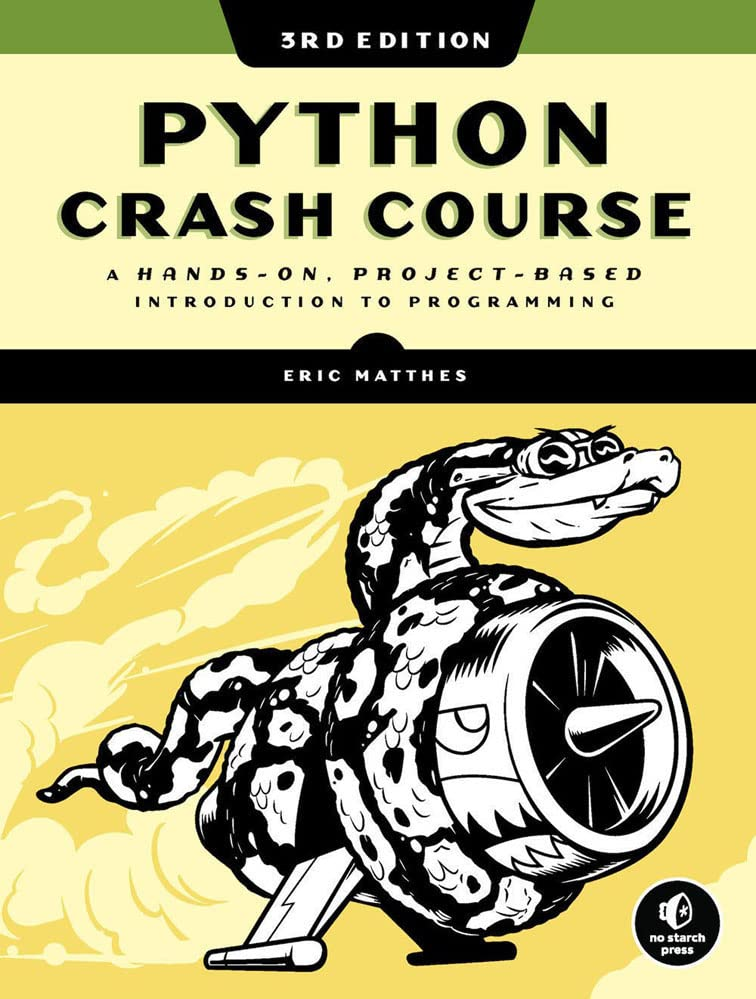

Antes de comenzar a escribir este artículo, me gustaría desear un _Feliz Año
Nuevo_ y un próspero 2023 a toda aquella persona que se adentre en estas líneas.

Revisando el blog, encuentro que su último artículo data de septiembre de 2021.
Como me sucede con otros proyectos personales, mi interés fluye al ritmo de
extrañas mareas y se suceden períodos de frenética actividad, con etapas dignas
de recibir el calificativo de hibernación. Si bien es cierto que ocasionalmente
he actualizado el proyecto que recoge enlaces a artículos de opinión asociados
con _Educación_, no puedo negar que el sitio web en sí ha sufrido un abandono de
proporciones épicas.

Con esta entrada tampoco quiero proclamar el advenimiento de tiempos de
constante actualización, ni mucho menos. Todavía encuentro complicado gestionar
el malabar que supone evitar que el trabajo me absorba por completo, ofrecer una
atención a los estudiantes que no se ajuste a unos estándares demasiado elevados
(a juicio de observadores externos...) y, además, compaginar todo ello con
cierta normalidad en mi convivencia del día a día con mi pareja.

Retahíla de quejas al margen, resulta que en una conversación con un compañero
de departamento en esos eternos días previos a las Navidades, surgió una idea
interesante. En la actualidad, se encarga de una optativa de 4º de la ESO y se
ha animado a realizar una introducción a la programación utilizando _Python_. A
este caldo de cultivo hay que añadir que, pocos días atrás, había caído en mis
manos una copia de la tercera edición del libro _Python Crash Course_, de Eric
Matthes y publicado por la curiosa editorial _No Starch Press_ (sus libros no
tienen desperdicio alguno y están escritos con un lenguaje muy ameno).

Al ojear el índice de dicho libro, había observado que el autor dedica tres
capítulos a implementar un juego utilizando la librería _Pygame_, un módulo
desconocido para mí y que siempre me ha despertado curiosidad. Así pues, no tuve
idea más brillante que comentar la posibilidad de escribir una adaptación de
esos tres capítulos para desarrollarse durante la optativa.

De esta forma, buena parte de mis _Navidades_ ha estado dedicada a una lectura
activa del libro, reescribiendo los ejemplos y abordando todos los ejercicios
que el autor propone, que no son pocos. El libro en sí hace honor a su título y
pretende enseñar al lector una gran variedad de conceptos en el mínimo espacio y
tiempo posible. Eso conlleva que, aunque se recomiende como lectura para
principiantes, el ritmo propuesto sea un tanto elevado y algunas ideas
requerirían quizá unas cuantas páginas adicionales. Si resulta el texto escogido
para una primera aproximación a la programación, en algunos momentos no dudo que
el lector experimente instantes de ''¿qué tipo de brujería es esta?''.

Mientras he ido revisando sus páginas, he tenido siempre esa sensación que
aparece cuando alguien lee de nuevo un libro. A medida que he avanzado, la
mayoría de conceptos me resultan familiares, pero han quedado relegados al
olvido. En _Python_, por falta de constancia principalmente, es cierto que no
paso de ser un eterno principiante y como propósito de _Año Nuevo_ me he
establecido como meta intentar alcanzar un nivel intermedio. Quizá construir
alguna aplicación gráfica, diseñar alguna página web desde cero... es decir,
salir del nivel teórico del bloque ''condicionales-bucles-funciones-clases'' y
trabajar con ellos a un nivel más aplicado.

Con esta idea en mente, algunas búsquedas asociadas y unos anuncios
personalizados que me conocen mejor que yo mismo, hace unos días aproveché una
especie de rebajas que el portal [Udemy](https://www.udemy.com/) ha ofrecido a
sus usuarios. He de confesar que siempre me he decantado por adquirir libros
antes que cursos a distancia. No obstante, algunas ofertas ofrecían tal cantidad
de contenido, por un precio sumamente reducido, que ha sido muy difícil resistir
la tentación.

Por tanto, además de libro de Eric Matthes, he adquirido los siguientes cursos
de _Udemy_:

- _100 Days of Code: The Complete Python Pro Bootcamp for 2023_
- _The Complete 2023 Web Development Bootcamp_

Ambos siguen ese formato _bootcamp_ que tan de moda parece que está últimamente.
Al momento de escribir estas líneas, ando enzarzado con el primero de ellos y he
conseguido completar cuatro de las cien secciones que lo componen. Las
sensaciones son buenas y los ejercicios que proponen me están resultando
bastante amenos.

Quizá vuelque parte del aprendizaje en el sitio web, aunque todavía no he
pensado cómo lo llevaría a cabo. Cruzo los dedos para que el propósito de Año
Nuevo tenga más éxito que el de acudir a un gimnasio.
