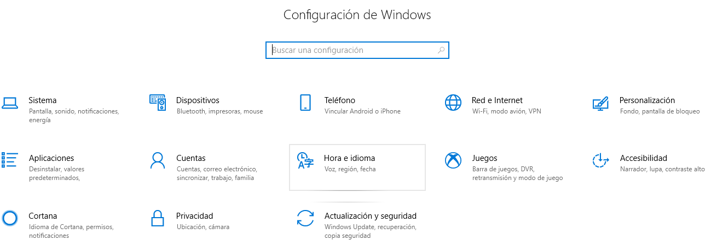
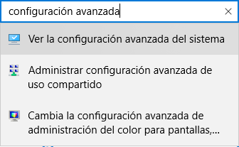
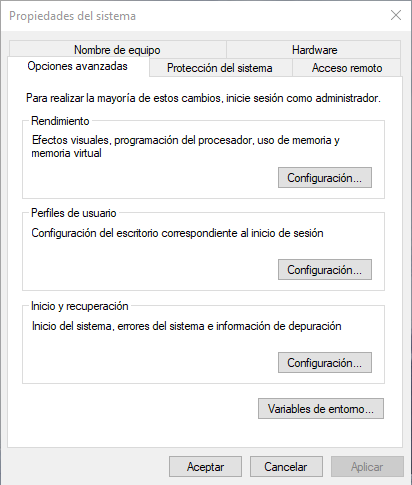
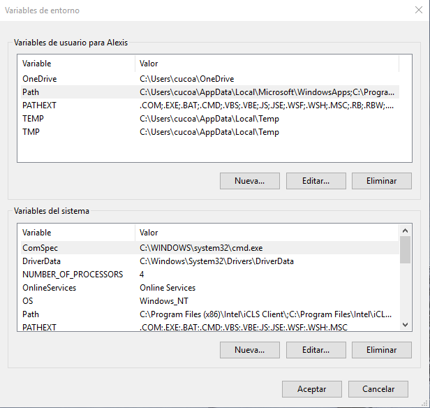

Llevar a cabo la instalación de _Hugo_ en _Windows_ es extremadamente fácil,
hecho que nos permite empezar a experimentar con esta tecnología en apenas unos
minutos. Veamos, sin más dilación, todo el proceso en detalle.

Así pues, en este segundo artículo catalogado bajo la etiqueta
[Metablog](/tags/metablog/), retomaremos la senda en el lugar que nos quedamos
al finalizar la [primera entrada](/blog/preparando-el-equipo-para-hugo/).
Recuerdo que, en ella, instalamos un par de útiles herramientas en nuestro
equipo (_git_ y _Sublime Text 3_) y nos creamos una cuenta en el portal
_GitHub_, que será donde alojemos tanto el código fuente de nuestros futuros
sitios web, como los propios sitios web en sí.

En la documentación oficial de _Hugo_, existe una extensa página dedicada a su
instalación, con una sección que orienta específicamente a los usuarios de
_Windows_ y a la que podemos acceder directamente a través de
[este enlace](https://gohugo.io/getting-started/installing#windows).

Los desarrolladores han intentado que la experiencia de instalación sea muy
intuitiva, pero, en mi opinión, alguna de las indicaciones puede no ser
coherente con la estructura de archivos y carpetas que hayamos decidido
implementar en nuestros equipos. ¿A qué se debe esta afirmación? Por ejemplo:

- _Hugo_ no deja de ser simplemente un programa, por lo que en lugar de
  instalarlo donde indica la guía, quizá sería mejor opción ubicarlo en la
  carpeta `Archivos de programa`.
- Nos señalan, en la mencionada guía, un directorio muy específico donde
  almacenar nuestros sitios web. No obstante, aunque vayamos a utilizar la
  pareja _git + GitHub_, es posible que nos interese, además, utilizar un
  servicio de alojamiento de archivos y, por tanto, ubicar las páginas en otra
  ruta diferente.

Simplemente lo comento para que quede claro que las instrucciones que, a
continuación, compartiré admiten cierta flexibilidad a la hora de llevarlas a
cabo. Dicho esto, sin más preámbulos, veamos cómo instalar _Hugo_ en _Windows_.

En primer lugar, bien desde la terminal, bien desde el explorador de archivos de
_Windows_, creamos en el directorio raíz de nuestro disco duro (generalmente
`C:\`) una carpeta denominada `Hugo`. En su interior engendramos otras dos
carpetas: `bin`, donde almacenaremos la aplicación, y `Sites`, donde ubicaremos
nuestros futuros sitios web. Al final, debemos tener disponibles las siguientes
dos rutas:

- `C:\Hugo\bin\`, y
- `C:\Hugo\Sites\`.

Para ir acostumbrándonos al uso de la terminal _Git Bash_, todo el anterior
proceso lo podíamos haber conseguido escribiendo en ella la siguiente serie de
comandos:

```
cd c:
```

```
mkdir Hugo
```

```
cd Hugo
```

```
mkdir bin Sites
```

A continuación, abrimos la página de descarga de _Hugo_ siguiendo
[este enlace](https://github.com/gohugoio/hugo/releases). A la hora de escribir
estas líneas, la versión más reciente es la etiquetada como `v0.42.2`. Ahora,
desplazamos con cuidado hacia abajo el extenso listado de ficheros, hasta dar
con el adecuado para nuestro sistema operativo (en mi caso es
`hugo_0.42.2_Windows-64bit.zip`). Hacemos clic sobre él e inmediatamente
comenzará la descarga a nuestro disco duro de un archivo comprimido.

Acto seguido, descomprimimos el contenido de dicho archivo en la ruta
`C:\Hugo\bin\` (o donde hayamos decidido que sería un buen sitio para almacenar
la aplicación) y borramos el fichero que hemos descargado, pues no vamos a
necesitarlo en un futuro próximo.

De esta manera, si desde la terminal nos desplazamos hasta la anterior ruta y
escribimos `hugo version`, recibiremos el siguiente mensaje
`Hugo Static Site Generator v0.42.2 windows/amd64 BuildDate: 2018-06-28T12:36:53Z`,
que indica que hemos llevado a cabo la instalación con éxito.

No obstante, rápidamente vamos a encontrar un pequeño inconveniente a la hora de
empezar a experimentar con _Hugo_. Si escribimos `hugo version` en cualquier
otra ruta distinta a la indicada arriba, recibiremos en la terminal un mensaje
de error como este: `bash: hugo: command not found`. Dado que nuestra intención
es poder utilizar la aplicación en cualquier ruta de nuestro disco duro, tenemos
que añadir la ubicación de _Hugo_ al `PATH` de _Windows_.

Cada versión de _Windows_ tiene una manera más o menos distinta y, en ocasiones,
ciertamente enrevesada, de editar el `PATH`. Para ello, en _Windows 10_,
comenzamos pulsando el botón de inicio y seleccionamos _Configuración_,
accediendo así a la siguiente ventana:



En el cuadro de búsqueda escribimos "configuración avanzada" y seleccionamos la
opción _Ver la configuración avanzada del sistema_, tal y como figura en la
siguiente imagen:



Apareciendo así esta ventana:



Hacemos clic en el botón _Variables de entorno..._, surgiendo entonces una nueva
ventana. En ella seleccionamos la fila del primer cuadro denominada _Path_ y
pulsamos el botón _Editar..._, que aparece justo debajo de dicho cuadro.



Surge, cual capricho de un diabólico destino que parece que quiere poner nuestro
temple a prueba, otra nueva ventana (ya por fin la última), donde tenemos que
hacer clic sobre el botón _Nuevo_ y escribir `C:\Hugo\bin\`. Finalmente, solo
nos resta ir pulsando sobre el botón _Aceptar_ sucesivas veces, hasta cerrar por
completo la ristra de ventanas precedentes que en unos segundos hemos acumulado.

Así, si en cualquier ruta del sistema ahora tecleamos en la terminal
`hugo version`, no aparecerá el anterior mensaje de comando desconocido, sino la
versión de la aplicación instalada, tal y como pretendíamos.

En el próximo artículo catalogado bajo la etiqueta [Metablog](/tags/metablog/)
exploraremos el proceso de creación de un sitio web utilizando _Hugo_.
