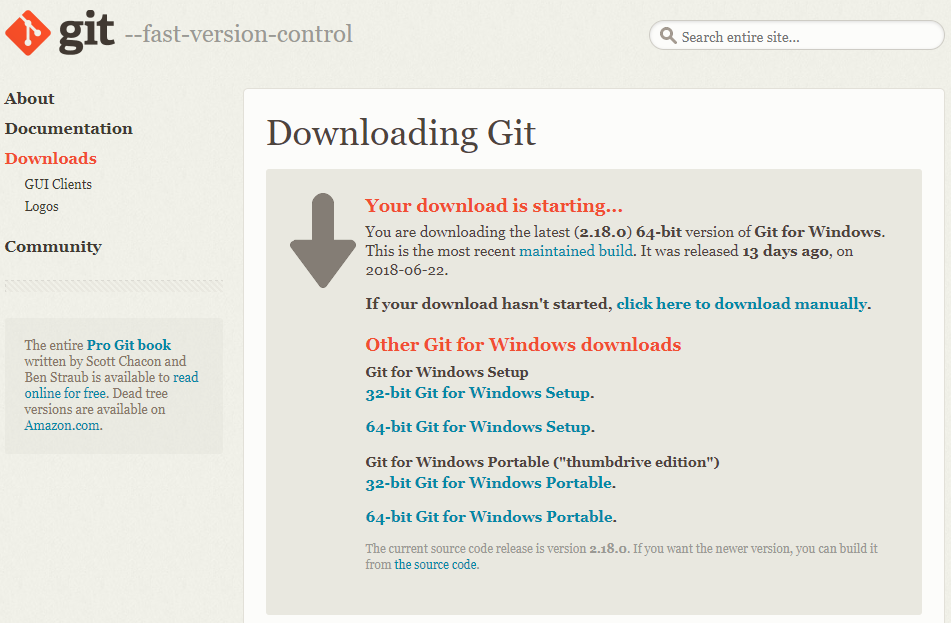
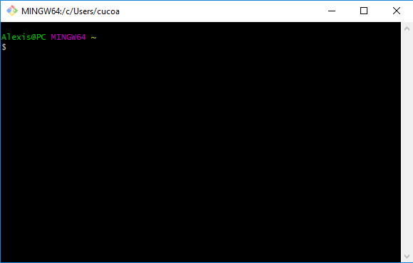
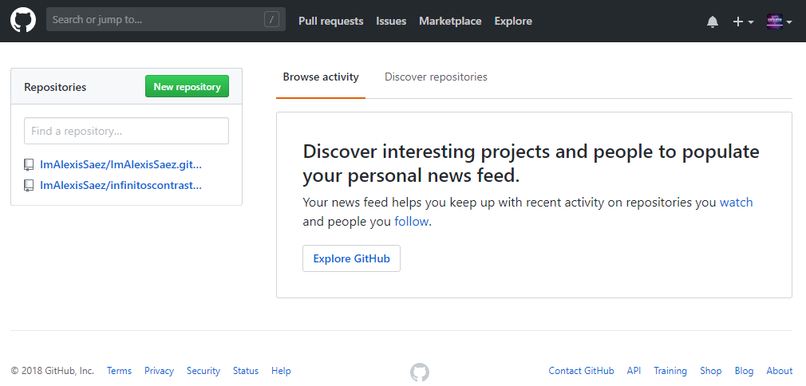
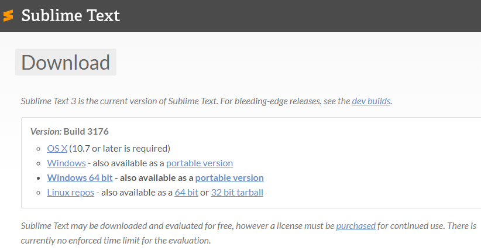

Antes de lanzarnos, sin más, a generar sitios web con _Hugo_, conviene que
instalemos una serie de herramientas que nos facilitarán la vida: un sistema de
control de versiones (_Git + GitHub_) y un editor de texto plano (_Sublime Text
3_).

Tal es el propósito de esta primera entrada, catalogada bajo la etiqueta
[Metablog](/tags/metablog/), que agrupará una serie de artículos que
documentarán todo el proceso de instalación de _Hugo_, el de la creación del
propio sitio web empleando dicho generador y el de la personalización de la
plantilla que actualmente estoy utilizando:
[Beautiful Hugo](https://themes.gohugo.io/beautifulhugo/).

### 1. Git

El sistema de control de versiones al que personalmente estoy acostumbrado es
_Git_, en cuya [web oficial](https://git-scm.com/) podemos encontrar una
impresionante cantidad de información de interés. Si es la primera vez que
escuchas hablar de _Git_ o, en general, de los sistemas de control de versiones,
quizá te resulte útil echar un vistazo a su [tutorial](https://try.github.io/).

La instalación de _Git_ en _Windows_ no podría ser más sencilla. Hacemos clic en
[este enlace](https://git-scm.com/download/win) y automáticamente se descargará
la versión más reciente de _Git_ (`2.18.0` a la hora de escribir estas líneas).

Una vez se haya completado la descarga, ejecutamos el archivo e instalamos el
programa. Durante el proceso de instalación tenemos que escoger en varios
momentos entre distintas opciones. A este respecto, he de comentar que las que
vienen marcadas por defecto me parecen adecuadas para una primera toma de
contacto con _Git_.

Al completar la instalación tenemos, además, acceso a una terminal de sistema,
_Git Bash_, que personalmente es la que utilizo. Si bien es cierto que tenemos
que emplear algunos comandos distintos a los podemos encontrar en la que por
defecto acompaña a _Windows_, es fácil llevar a cabo la transición de una
terminal a otra (puede resultar de ayuda este
[listado de comandos](https://ss64.com/bash/)).

### 2. GitHub

_GitHub_ es una plataforma de desarrollo colaborativo utilizada para almacenar
proyectos empleando el sistema de control de versiones _Git_. Podemos encontrar
más información en su [web oficial](https://github.com/). Al igual que antes, si
es la primera vez que accedes a esta plataforma, convendría que le dedicases
unos minutos al tutorial _Hello World_, disponible en
[esta página](https://guides.github.com/).

Utilizaremos este portal para subir los archivos fuente que permitirán generar
el sitio web, así como para alojar el propio sitio web en sí. Únicamente
necesitaremos crear una cuenta de usuario para ello.

### 3. Sublime Text 3

El dicho "para gustos los colores" tendría en este apartado la versión "para
gustos los editores de texto plano". En mi caso, los proyectos de programación
que he realizado y todo el trabajo con generadores de web estáticas los he
llevado a cabo, tanto con el antiguo _Sublime Text 2_, como con su más reciente
versión: _Sublime Text 3_.

Este editor de texto plano es bastante potente, rápido y la comunidad puede
extender sus funcionalidades a través de paquetes. Además, su versión ''de
prueba'' te permite utilizar la herramienta sin restricción alguna durante un
período de tiempo ilimitado, con la única pega de aparecer un mensaje cada 20 o
30 veces que salvemos cualquier archivo y que te invita a comprar una licencia.

Nos podemos hacer con él a través de
[este enlace](https://www.sublimetext.com/3). Su proceso de instalación es
similar

Además de cumplir de manera excelente sus labores a la hora de editar cualquier
archivo de texto plano, _Sublime Text 3_ me encanta como herramienta para
trabajar con archivos de tipo _markdown_, que será el formato que vamos a
emplear para redactar el contenido de nuestro sitio web. En un futuro no muy
lejano tengo pensado escribir un artículo explicando cómo llevar a cabo la
configuración de este programa para lidiar de forma agradable con dicho tipo de
ficheros.

Y hasta aquí el primer artículo catalogado bajo la etiqueta
[Metablog](/tags/metablog/), que deja nuestros equipos a punto para proceder a
la instalación de _Hugo_ y generar un sitio web.
