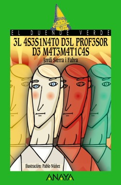

En este artículo, vamos a echar un vistazo a una interesante novela, con las
matemáticas como telón de fondo, que viene de la mano de _Jordi Sierra i Fabra_.
¿Será un libro adecuado para recomendar como lectura durante el curso académico?

En la contraportada encontramos el siguiente texto:

> Un profesor propone a sus alumnos un juego como examen para aprobar las
> matemáticas. El viernes por la tarde, el profesor muere, pero, antes de
> fallecer, comenta a sus alumnos que el sobre que hay en su bolsillo les
> indicará cómo buscar a su asesino. No deben fallarle...

La sinopsis del párrafo anterior nos plantea una idea muy atractiva para un
libro que encontramos en la colección _El Duende Verde_, de la editorial
_Anaya_. A través de
[este enlace](https://www.anayainfantilyjuvenil.com/libro.php?codigo_comercial=1571123)
podemos acceder a la información completa del título, cuya portada figura a
continuación.

A primera vista, parece que ha caído en nuestras manos una especie de novela de
intriga, detectivesca de corazón. ¿Y qué decir del título? Seguro que despertará
la imaginación de muchas personas, sobre todo de aquellas cuya relación con la
materia no fuese (o sea) todo lo satisfactoria que debiera. Ahora bien, ya lo
avisa el propio autor, en las primeras páginas:

> Asesinar al profe de mates no sirve de nada. Ponen a otro en su lugar y ya
> está.

El texto está recomendado a lectores mayores de 12 años, hecho que nos da una
pista sobre el lenguaje utilizado o la predictibilidad de la historia. Es una
lectura amena, entretenida, para disfrutar por completo en una de esas tardes de
ocio, ya que no es muy extensa.

No obstante, un detalle sí que captó rápidamente mi atención: la manera en la
que se comunican los tres protagonistas del libro, alumnos del profesor y
detectives de una tarde por encargo. Aunque es cierto que la novela tiene unos
cuantos años a sus espaldas (se publicó en 2002), enseguida se aprecia un tipo
de lenguaje forzado y muy artificial para las conversaciones de los estudiantes.
Es difícil que un lector adolescente se identifique con esa forma de expresarse,
ni en los tiempos que corren, ni siquiera cuando el libro vio la luz. Esta
situación, por desgracia, resta en mi opinión bastante credibilidad a la
historia.

Detalles literarios al margen, pasemos a comentar el contenido matemático del
texto. Los alumnos han de resolver una serie de retos, planteados en forma de
problemas, adivinanzas o acertijos y para los cuales, más que conocimientos de
la materia (el trabajo con ecuaciones lineales es el contenido matemático más
avanzado que aparece si mal no recuerdo), necesitarán utilizar toda esa
creatividad que rezuma de sus poros en la edad en que se encuentran.

Los problemas forman parte del folclore matemático y todo profesor de la materia
habrá disfrutado de ellos en algún momento de su carrera. No así seguramente los
alumnos, más acostumbrados a invertir su tiempo en el aula de matemáticas
llevando a cabo ejercicios y no auténticos problemas. Escribiendo de memoria,
encontramos, entre otros, el clásico de la mosca que vuela entre bicicletas, el
de los espías que viven en cuatro casas del mismo barrio o el que relaciona
edades entre distintos miembros de una familia.

Los protagonistas de la novela logran, empleando mucha creatividad, superar cada
uno de los retos, mostrando al lector la solución a través de un diálogo repleto
de ideas originales y salpicado de múltiples quejas y frustraciones por la
dificultad de alguno de los enunciados planteados. Precisamente aquí sufre la
novela otro serio varapalo en lo que a credibilidad respecta. Es bastante
improbable que alumnos de los primeros cursos de educación secundaria sean
capaces de abordar con éxito los retos planteados y sobre todo teniendo en
cuenta el estrecho margen de tiempo del que disponen.

No obstante, este hecho presenta la oportunidad de llevar la lectura al aula, y
dedicar cierta parte de una las sesiones (aquellas que van tras educación
física, las que tienen lugar en las últimas horas de la mañana o las de los
viernes, por ejemplo) a desentrañar, con paciencia, los problemas que aparecen
en los capítulos del texto. Organizando bien sus contenidos, estimo que sería
una actividad que podríamos ofrecer a lo largo de un trimestre completo.

Muchas de las estrategias de resolución de problemas que figuran en el libro
pueden extrapolarse a las actividades que estén desarrollando en la unidad
didáctica de turno. Introducirlas como hace la novela, a modo de reto o
adivinanza, seguramente provoque que los estudiantes las asimilen más fácilmente
y las asocien rápidamente con el texto, quedando así disponibles en su memoria
para emplearlas en el aula en futuras ocasiones.

Así pues, ''El asesinato del profesor de matemáticas'' es un libro de lectura
que recomendaría encarecidamente para el aula, en los primeros cursos de
educación secundaria, siempre y cuando venga acompañado de su estudio en unas
cuantas sesiones del curso.
