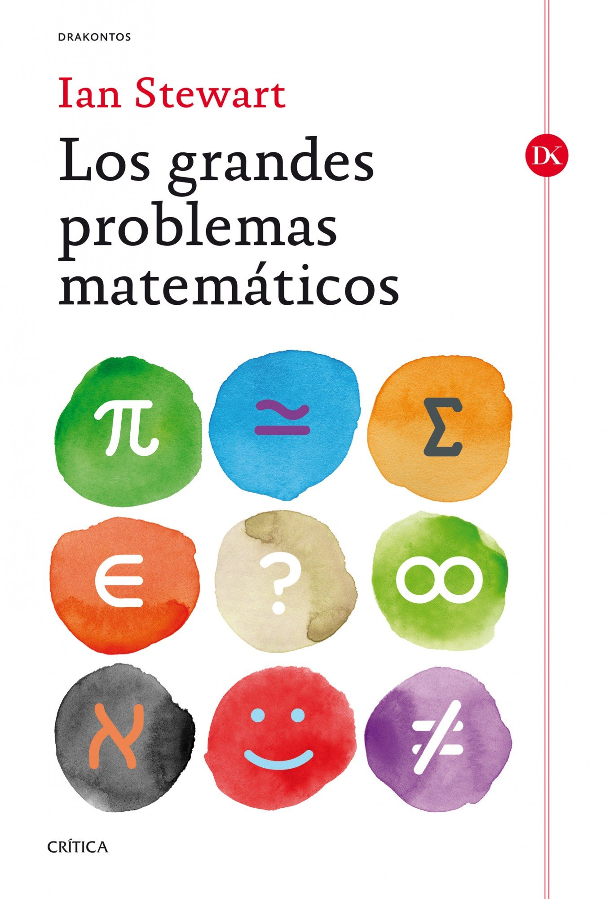

En estas fechas estivales suelo aprovechar para revisar esa biblioteca mía que
acumula sin cesar libros para un ''más adelante'' que parece nunca termina de
llegar. Así pues, me he animado a abordar alguna de esas lecturas pendientes y,
en concreto, la elegida ha sido **Los grandes problemas matemáticos**, que viene
de la mano de **Ian Stewart**.

En principio, la lectura se plantea como muy interesante, pues aborda desde un
punto de vista histórico y divulgativo algunos de los grandes retos de esta
disciplina. Para muestra un botón:

- La conjetura de Goldbach
- La cuadratura del círculo
- El teorema de los cuatro colores
- La conjetura de Kepler
- La conjetura de Mordell
- El último teorema de Fermat
- El problema de los tres cuerpos
- La hipótesis de Riemann
- La conjetura de Poincaré
- El problema P / NP
- La ecuación de Navier-Stokes
- La hipótesis del hueco de masas
- La conjetura de Birch-Swinnerton-Dyer
- La conjetura de Hodge

Antes de comenzar la lectura tenía conocimiento previo, en mayor o menor
profundidad, de algunos de estos resultados; pero confieso que desconocía por
completo la conjetura de Mordell, así como los cuatro últimos problemas.

Con esta base en mente, es una delicia leer todos y cada uno de los capítulos,
pues el autor no se limita a exponer el estado actual de los mencionados
problemas (teniendo en cuenta que el texto se publicó en el año 2014), sino que
se centra en relatar su evolución histórica. Así, narra con maestría el
planteamiento de estos, ubicándolos de manera acertada en su contexto histórico
y pasando después a examinar cómo han ido abordándose.

De esta manera, cada capítulo se convierte en una épica batalla, repleta de
pequeñas escaramuzas en forma de leves avances hacia la resolución de estos
famosos retos. En ellas se observa la tenacidad de la comunidad matemática, así
como las múltiples relaciones existentes entre las distintas áreas que componen
esta disciplina. Unas áreas que en la actualidad parecen compartimentos
estancos, pero nada más alejado de la realidad, pues en muchas ocasiones
problemas encasillados en uno de estos compartimentos han terminado por
resolverse a través de herramientas empleadas en otros.

No obstante, el libro se enfrenta a una complicada tarea: ¿cómo transmitir estas
epopeyas de una manera divulgativa para alcanzar la mayor audiencia posible? La
teoría y las estrategias detrás de cada uno de los avances en estos problemas
enseguida se vuelven sumamente complejas y especializadas. En mi opinión,
incluso fuera del alcance de matemáticos que no se dediquen a la investigación
en los correspondientes campos.

A este respecto, el autor camina constantemente sobre una cuerda floja,
intentando conseguir el equilibro perfecto entre la transmisión intuitiva de las
ideas detrás de los avances y el rigor que caracteriza a esta disciplina. En
ocasiones, admito que lo consigue con bastante éxito; pero en otras, se adentra
en exceso en detalles técnicos y la lectura resulta un tanto abrumadora. En
cualquier caso, se percibe sin dificultades la épica del avance en la batalla y,
para una lectura de divulgación, estimo que los mencionados detalles técnicos
pueden omitirse sin que ello menoscabe su valor.

Por tanto, a pesar de esta salvedad, es una lectura altamente recomendable, pues
el contexto histórico adoptado otorga una envergadura impresionante a estos
grandes problemas matemáticos.
