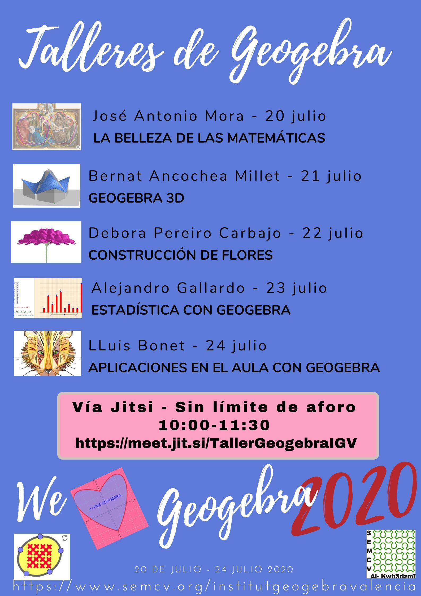

La _Sociedad de Educación Matemática de la Comunidad Valenciana_ (SEMCV)
**Al-Khwarizmi** nos ofrece la posibilidad de disfrutar, en diferido, de unos
talleres de _GeoGebra_ llevados a cabo entre los días 20 y 24 de julio. El
comunicado oficial está disponible en
[este enlace](https://www.semcv.org/tallersigv/1117-talleres-de-geogebra), de
donde, a continuación, adjunto el cartel anunciador de los mencionados talleres
y sus correspondientes vídeos.

### La belleza de las matemáticas (_José Antonio Mora_)



### GeoGebra 3D (_Bernat Ancochea Millet_)



### Construcción de flores (_Debora Pereiro Carbajo_)



### Estadística con GeoGebra (_Alejandro Gallardo_)



### Aplicaciones en el AULA con GeoGebra (_Lluís Bonet_)


