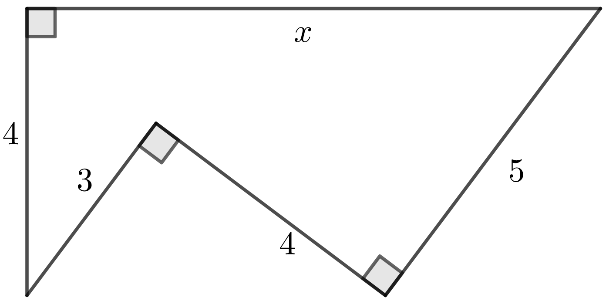
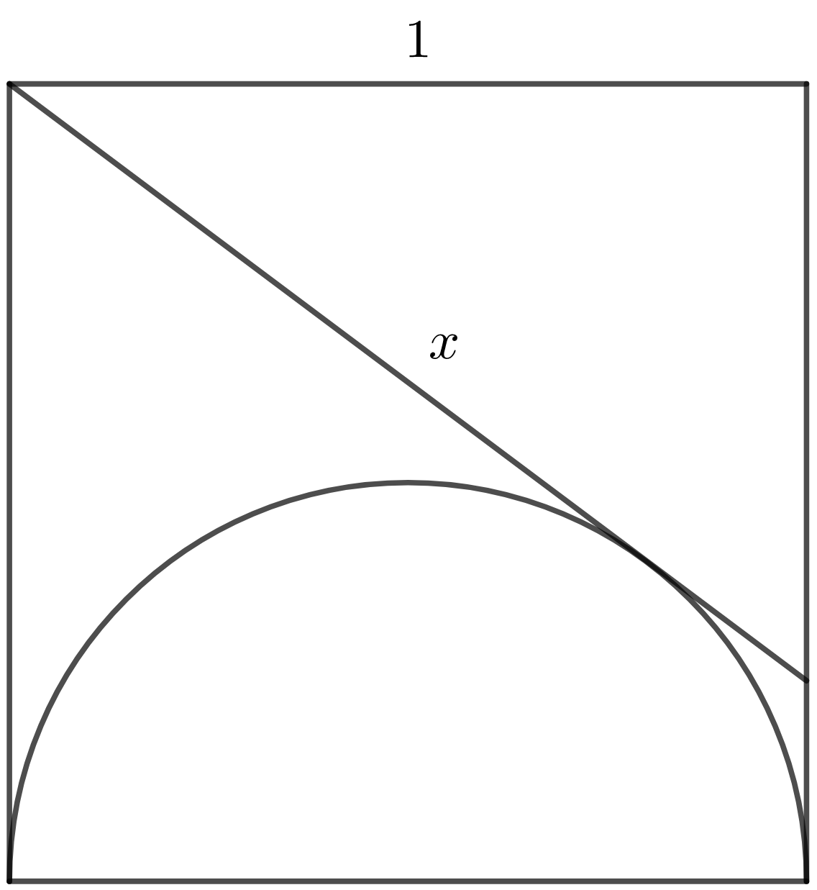

## Problemas resueltos

Pendiente.

## Problemas propuestos

**Problema 1**: calcula el valor de
$\sqrt[3]{8 + 3\sqrt{21}} + \sqrt[3]{8 - 3\sqrt{21}}$.

**Problema 2:** dada la figura, halla el valor de $x$.

**Problema 3:** dado un cuadrado, cuyo lado mide una unidad, halla la longitud
del segmento $x$ que aparece en la figura, tangente a la semicircunferencia
inscrita.

